# Relizane is Down! Solution
### Author: Houssem0x1

## General info

- By looking into the handout, it is clear that we have are dealing wih a Windows system (Win10 confirmed bia registry) and the Triage was acquired via KAPE.

## Q1: What was the last text copied by the victim?

`Answer`: game over!

- The chain to get the answer is quite long and requires multi-steps, but very interesting.
The intention of this question is clear, something was copied. In windows the first thing that comes in mind the clipbaord, but it is not always enabled, in our case it is enabled and we can confirm that by checking the relevant registry key.
We have 02 Candidates to check in the system to find clipboard data:
- first one is the `Smartlookup` table in the `C:\Users\bello\AppData\Local\ConnectedDevicesPlatform\4af50cebadd292cb\ActivitiesCache.db` database, but this one will get populated only if 02 Conditions are met, There should be a microsoft account used to log in (not local account) and Synchronization is enabled (enabled by default). Looking at the aforementionned db table, it looks empty, so sure that some of the conditions are not met. We can check the registy or the log in event logs or the presence of `C:\Windows\System32\config\systemprofile\AppData\Local\Microsoft\Windows\MicrosoftAccount\e04d7806af8647d7ddbb2788791c4a0a83a028be08c3fb6d11bddb3183170184\CacheData` cache file and confirm that there is a microsoft account logged in, so we assume that the Sync option is disabled (at least at this moment!) and of course we can confirm that via the relevant registry keys.

- Second one, is the clipboard history folder at `C:\Users\bello\AppData\Local\Microsoft\Windows\Clipboard` folder, with 02 sub-directories `HistoryData` and `Pinned`.
Under `HistoryData`there is a folder with the event a copy event GUID as its name but this folder is empty. the creation/modification date of this folder is when the copy action happenned.
Under `Pinned` folder there is a the pin event folder with the event GUID as its name, inside it we find a `metadata.json` file giving the timestamp of the event and the source which was local in our case , and another folder `{D4315CDF-3E40-4E08-B8BA-220AF192A67F}` which is our key to the next steps. We see 03 files:
    **Note: Note that at this stage the Sync option is now enabled because it is a condition so the above folder is populated**

    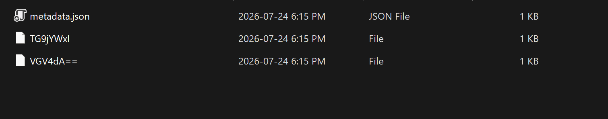

    this nested `metadata.json` gives more details about the content of the pinned data itself, for example the type of the data (string, image etc.) and wether it is encrypted.
    ```
    {"formatMetadata":{"Locale":{"dataType":"Stream","collectionType":"None","isEncrypted":true},"Text":{"dataType":"String","collectionType":"None","isEncrypted":true}},"sourceAppId":"","property":{}}
    ```

    and the 02 other base64 named files, `TG9jYWxl` which translates to the word `locale` , and `VGV4dA==` which translates to the word `Text` and this one looks interesting. loading it into a hex editor it is clear that is encrypted. By googling and reading some blogs we understand the the data blob is encrypted by DPAPI and excatly DPAPI-NG the new version of DPAPI introduced in late Windows 8 versions.
    So in order to decrypt it, we need the user masterkey files decrypted. the user masterkey files (usually 03 but only 01 will decrypt the encrypted data blob) are under `C:\Users\bello\AppData\Roaming\Microsoft\Protect\S-1-5-21-1256453946-4022582877-3363549628-1001`
    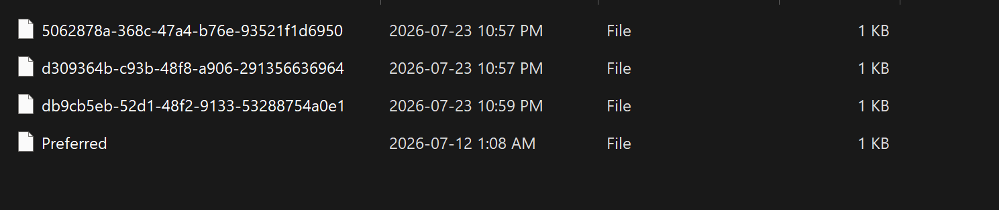
    We can use impacket-dpapi for the decryption (already installed on kali). The command is:
    ```
    impacket-dpapi masterkey \
  -file "./Protect/S-1-5-21-.../MASTERKEY-GUID" \
  -sid "S-1-5-21-...-1001" \
  -hashes "aad3b435b51404eeaad3b435b51404ee:USER_NT_HASH"
    ```
    or:
    ```
    impacket-dpapi masterkey \
  -file "./Protect/S-1-5-21-.../MASTERKEY-GUID" \
  -sid "S-1-5-21-...-1001" \
  -password "WindowsPassword"
    ```
    since we don;t have the user's account password, we still need NT hash of the user's password, we can extract it from the registry using (we already have them in the triage):
    ```
    impacket-secretsdump \
  -sam SAM \
  -system SYSTEM \
  -security SECURITY \
  LOCAL
    ```

    the NT hash is: `b0b3cc326fc5be4dca93740163ff8406` and it is not crackable. (we can try on the side but it is secure enough)

    so now with this the full command:

    ```
    impacket-dpapi masterkey \
  -file "./Protect/S-1-5-21-1256453946-4022582877-3363549628-1001/MASTERKEY-GUID" \
  -sid "S-1-5-21-1256453946-4022582877-3363549628-1001" \
  -hashes "aad3b435b51404eeaad3b435b51404ee:b0b3cc326fc5be4dca93740163ff8406"
    ```

    but unfortunetly this will not work, why? by googling and googling and googling... We undertand when a microsoft account is what is used to log in, the system generates a new random password for the account to be used by the OS in the background operations, and indeed we need this generated password to decrypt any encrypted DPAPI data blob.
    This generated password is stored in the following cache file `C:\Windows\System32\config\systemprofile\AppData\Local\Microsoft\Windows\MicrosoftAccount\e04d7806af8647d7ddbb2788791c4a0a83a028be08c3fb6d11bddb3183170184\CacheData` but this one is encrypted using the actual microsoft account passwsord which something never stored locally (something like your Gmail password for example). So, our bet will be that the user/victim is storing it manually somewhere in the system or in a password manager for ex.

    By enumerating the system, we see Keepass is installed and was lauched several times but we still need the keepass database and its master password to unlock it and see what's inside :
    By navigating the system files, we find an archive named `exfil.7z` we can assume from now that the attacker saved data for exfiltraion, after unzipping it we have 02 files: `Database.kdbx` and `KeePass.dmp`. after googling we understand that the user was using an vulnerable version of KeePass and the PoC to it is: [https://github.com/vdohney/keepass-password-dumper](https://github.com/vdohney/keepass-password-dumper).
    Due to the exploit nature, the first char can't be retrieved:

    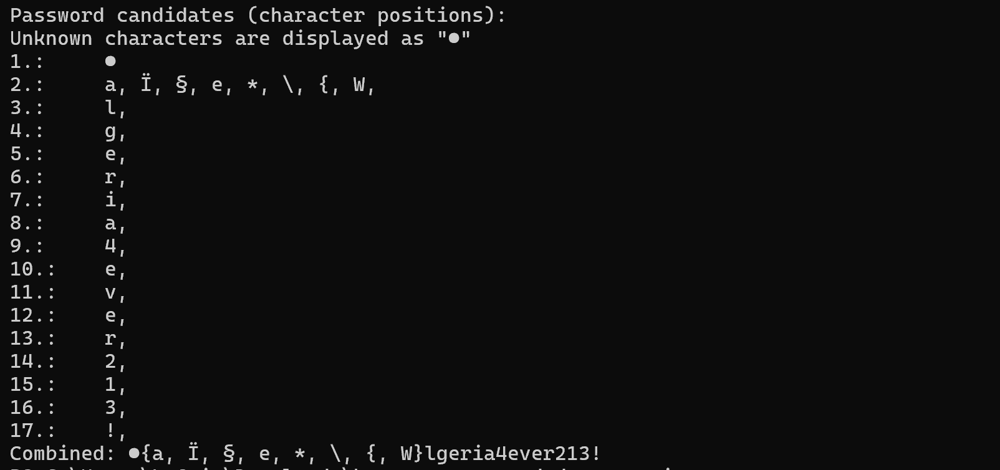

    but it is easy from this stage as we can bruteforce it via hashcat, so final master password for the DB is: `#algeria4ever213!`

    then:
    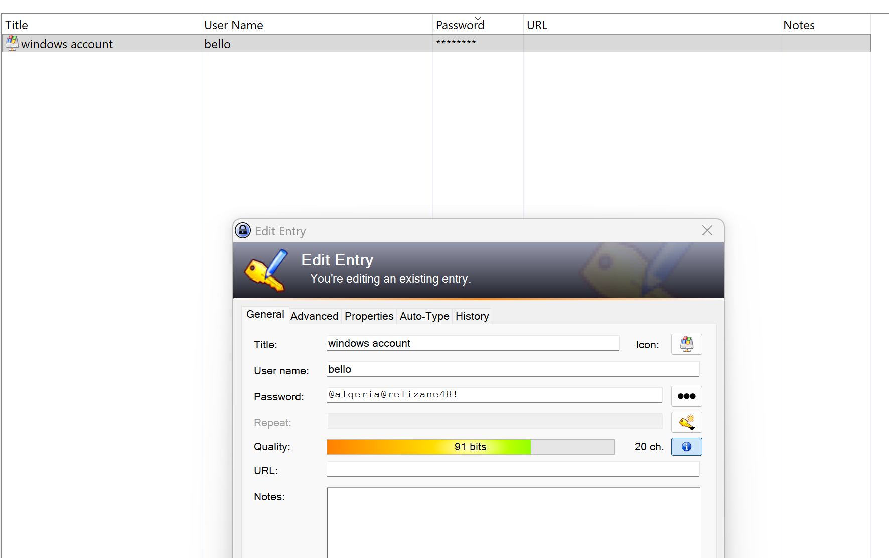

    and luckily now we have the microsoft account passwrod `@algeria@relizane48!`, so we can continure the DPAPI Masterkey decryption process.

    Now, as we said we need to get that random generated account password stored in that cache file and the tool for it is: [MadPassExt by nirsoft](https://www.nirsoft.net/utils/microsoft_account_dpapi_password.html)
    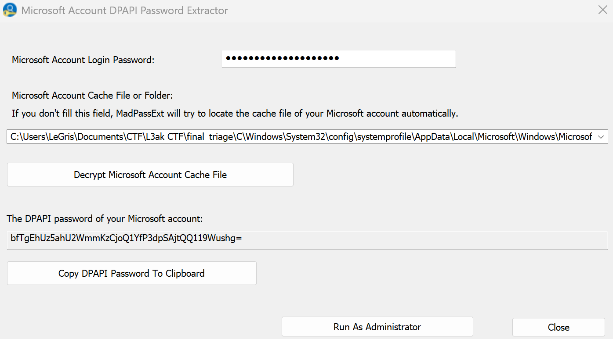

    now:
     ```
    impacket-dpapi masterkey \
  -file "./Protect/S-1-5-21-.../MASTERKEY-GUID" \
  -sid "S-1-5-21-...-1001" \
  -password "WindowsPassword"
    ```
    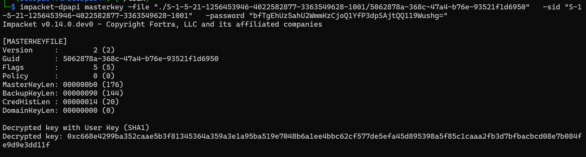

    the same for the 02 other masterkey files (after testing the one in the screenshot is the one that will work).
    in order to make it compatible with the tools we will use, we will save it as raw instead of hex.
    ` echo "668e4299ba352caae5b3f81345364a359a3e1a95ba519e7048b6a1ee4bbc62cf577de5efa45d895398a5f85c1caaa2fb3d7bfbacbcd08e7b084fe9d9e3dd11f" | xxd -r -p > decrypted-masterkey.bin`

    now, we have the masterkey decrypted and we have the clipboard pinned data blob `VGV4dA==` file also ready.

    now we need the script that implements the DPAPI-NG algorithm and performs decryption. I looked online and I didn't find anything that really works as intended, most interesting one is [https://github.com/wat4r/dpapitk](https://github.com/wat4r/dpapitk) but this one is for general DPAPI-NG data blob and the clipboard data blob specifically as this one is wrapped with some custom fromat and headers. so, with the help of AI to understand the format and algorithm we need to make our own script [dpapi_ng_decrypt.py](dpapi_ng_decrypt.py)

    

## Q2: When did the victim visit the malicious website?
 `answer:` 2026-07-24 02:08:02
 website is: houssem0x1.me (disguised as a fake cybersecurity academy website)
  `artifact`: chrome web browsing history (sessions/tabs folder as the url was typed manually) `C:\Users\bello\AppData\Local\Google\Chrome\User Data\Default\Sessions\Tabs_13429404740976388`
  `tools`: browser-forensic-chrome, or Hindsight or strings!

    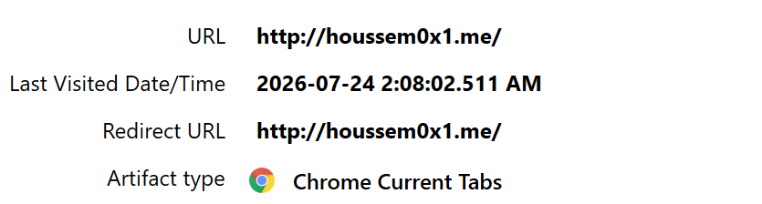

## Q3:  What is the the Mitre ATT&CK sub-technique ID relevant to the way the Threat actor gained execution on the victim's machine?

  `answer`: T1204.004
  by checking the website `houssem0x1.me` on waybackmachine it is clear the the user got compromised using ClickFix technique. So it is `User Execution: Malicious Copy and Paste`

  `tools` : Mitre ATT&CK website.

## Q4: What is the filename of the legitimate software that the malware was disguised as?

  `answer`: FTK_Imager.exe
  the command that was copied to clipbaord (ClicFix technique) was pasted and logged by powershell, which tells us that the the implant was named `FTK_Imager.exe`.
  `artifact`: powershell history file `C\Users\bello\AppData\Roaming\Microsoft\Windows\PowerShell\PSReadline\ConsoleHost_history.txt`
  `tools` : text editor
  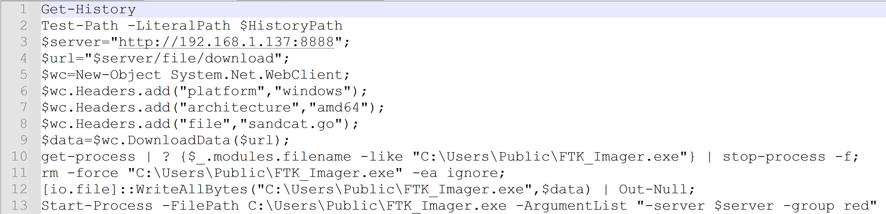

## Q5: What is the SHA-1 hash of the malware?

  `answer`: 02acd0e7345573217eda62b36d816e7f97f61072
  `Artifact`: Amcache.hve is the artifact that gives the SHA-1 hash (and other Metadata) of executable that was executed on the system.
  `tools`: Any Amcache parser, preferably from eric zimmerman tools.
  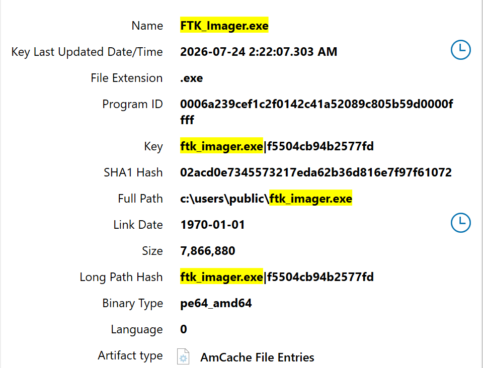


## Q6: Which Mitre ATT&CK stealth technique best describes the action of the identified in the previous question?

  `answer`: Masquerading
  it is clear that the malware is masquerading a legitimate foresics tool name; FTK Imager.

  `tools`: Mitre ATT&CK website.  (https://attack.mitre.org/techniques/T1036/)

## Q7: What is the username and the NT hash of the new admin account that the TA created as for their 1st persistence technique?  (username_hash)

  `answer`: bella_20bd1816be8e256a939a58da452660d7
  `artifact`: SAM, SYSTEM registry hives.
  `tools`: secretsdump.py (part of impacket)

  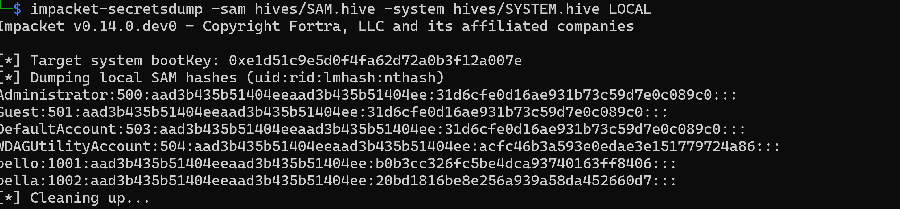


## Q8: What is the the Mitre ATT&CK sub-technique ID relevant to the 2nd Persistence mechanism achieved by the TA?

  `answer`:  T1547.004
  Since the events logs were cleared by the TA, the artifacts are quite limited (unless you check every place manually). But, luckily MS Defender was screening on the background and spotted lot of harmful events. And, as you can see in the screenshot below, the persistence technique is `Boot or Logon Autostart Execution: Winlogon Helper DLL` and this one can be abused even with executables not only dlls.

  `Artifact`: Ms Windows Defender MPLog logs at `C:\ProgramData\Microsoft\Windows Defender\Support\MPLog-20260129-234745.log`
  `tools`: Text editor.

  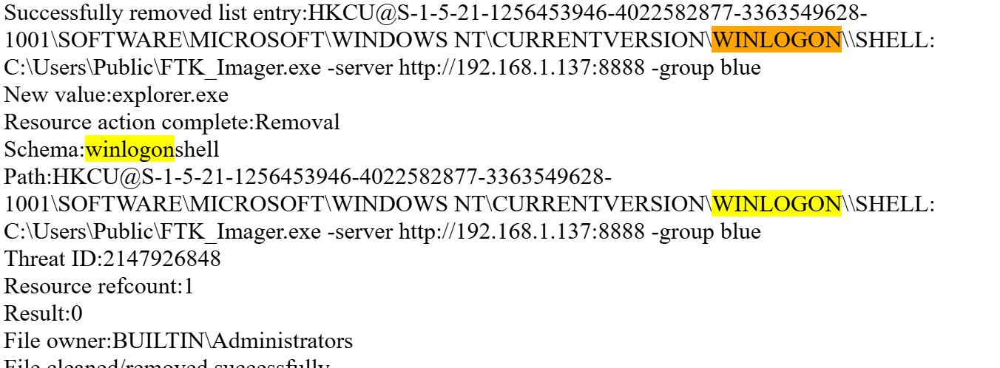

 ## Q9: MS Windows defender flagged the malicious file/object responsible for the 2nd persistence mechanism identified in the previous question. What is its threat tracking size in bytes?

  `answer:` 7866880
  `artifact:` `C:\ProgramData\Microsoft\Windows Defender\Scans\History\Service\DetectionHistory\18`
  `tools:` [defender-detectionhistory-parser](https://github.com/jklepsercyber/defender-detectionhistory-parser)

  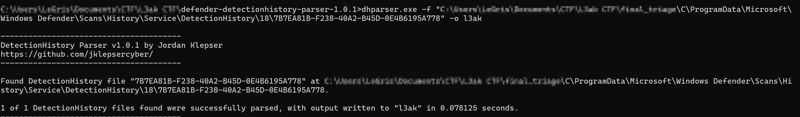
  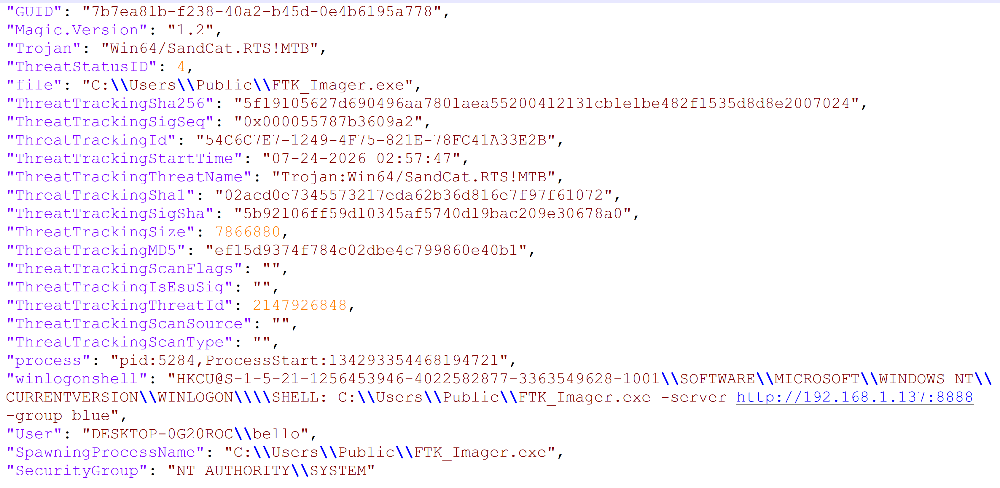

 ## Q10: the TA downloaded a RMM software on the system for further activities, what is the tool name and when it was downloaded?

  `Answer:` helpwire_2026-07-24 02:51:40
  `Artifact:` Certutil Cache `C:\Users\bello\AppData\LocalLow\Microsoft\CryptnetUrlCache\MetaData`
  `tools:` [CryptnetUrlCacheParser](https://github.com/AbdulRhmanAlfaifi/CryptnetURLCacheParser)

  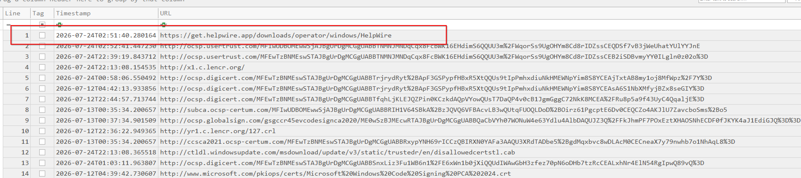

## Q11: How many bytes of data did the malware binary send to the C2 server in total?

  `answer:` 139444
  `artifact:` SRUM `C:\Windows\System32\SRU\SRUDB.dat`
  `tools:` Any SRUM DB parser suck as: SrumECmd - Eric Zimmerman

  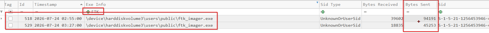

## Q12: What is the total runtime duration of the malware in Ms (Milliseconds)?

  `answer:` 139444
  `artifact:` SRUM database `C:\Windows\System32\SRU\SRUDB.dat`
  `tools:` Any SRUM DB parser suck as: SrumECmd - Eric Zimmerman

  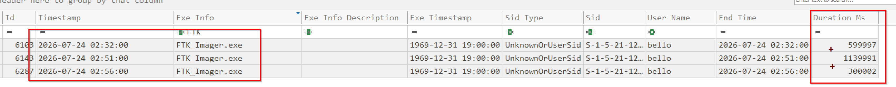

## Q13: The TA dropped a malicious script for data exfiltration, what is the script filename and what is the the IP address the data was being exfiltrated to?

  `answer:` up.ps1_106.107.1.148
  Checking the filesystem or jumpstarts/LNKs for any interesting malicious scripts, we understand that there was a `up.ps1` powershell script under `C\Users\Public\Downloads` but we don't have it in the triage files. Checking the $MFT we can confrim its location path and also it gives us its size on the disk which is `611` bytes; means it can be a resident file and we can recover its content via the $MFT.
  `artifact`: $MFT
  `tools`: MFTECmd, MFTExplorer, Strings...
  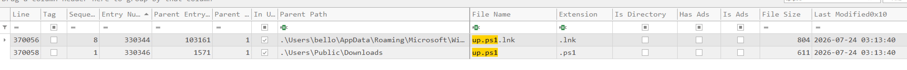

  `MFTECmd.exe -f "C:\$MFT"  --de 330346-1`

  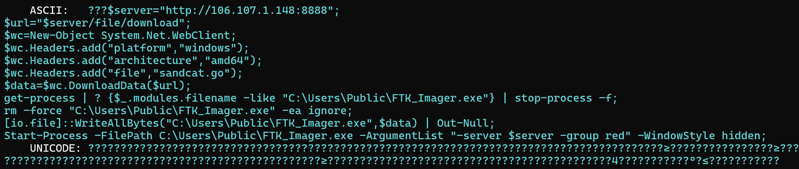

## Q14: What is the execution/launch timestamp of the exfiltration script identified in the previous question?

  `answer:` 2026-07-24 03:16:02
  `Artifact:` for this one need to corelate between the powershell history file     `C\Users\bello\AppData\Roaming\Microsoft\Windows\PowerShell\PSReadline\ConsoleHost_history.txt` and `$USNJRNL`. As show below in the screenshots, the exfiltration script `up.ps1` was launched by `.\ps1` command in which it was executed right before very the last command  `tar`. So in the usnjrnl we track `ConsoleHost_history.txt` before last modification time with the attribute `DataExtend`.

  `tools`: text editor, MFTECmd or any $J parser.

  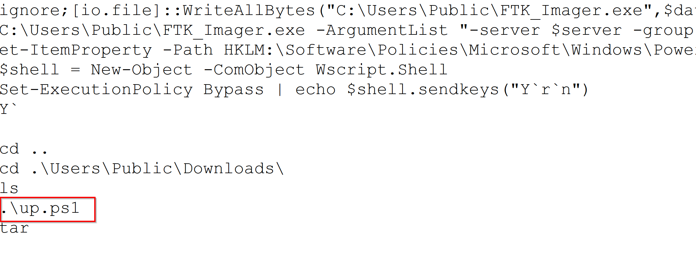
  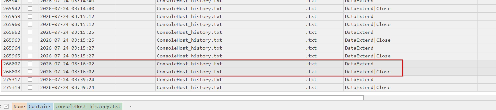

## Q15: Recovery procedure is documented in a RTF document, what is the last name of document author and what he advises as first recovery step?

  `answer:` Zakrout_take a deep breath
  `Artifact`: File is `C:\Users\bello\Documents\recovery_procedure.rtf` and to recover its content, we can refer to the Windows search index DB `C:\ProgramData\Microsoft\search\data\applications\windows\Windows.edb`

  `tools:` [sidr](https://github.com/strozfriedberg/sidr)

  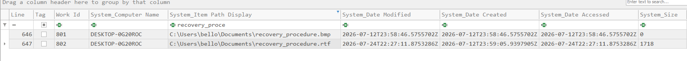
  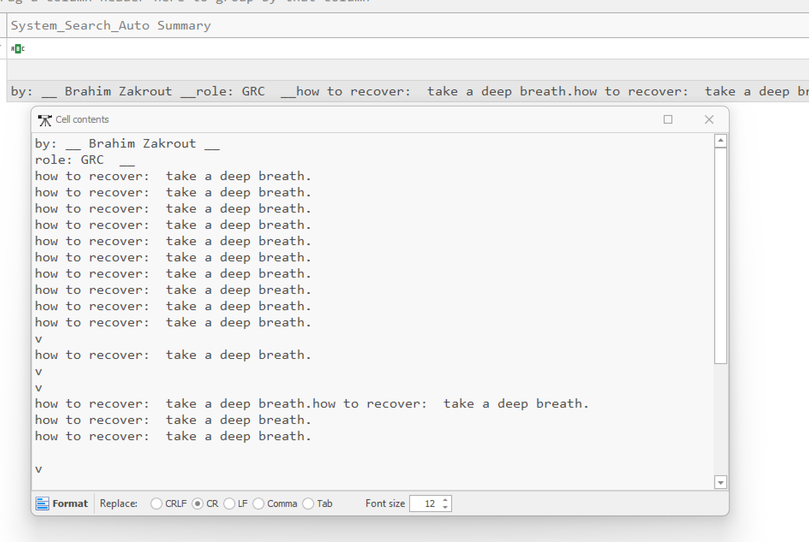

## Q16: As for anti-forensics, When did the TA clear the event logs?

  `answer:` 2026-07-24 03:35:10
  `Artifact:` Windows Event Logs (SYSTEM or Security) `C:\Windows\System32\winevt\Logs`

  `Tools`: EvtxCMD or any evtx log viewer (just consider timezones)

  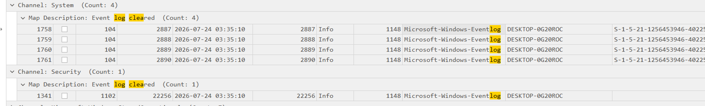

## Q17: Besides data exfiltration, the TA deployed a ransomware at the end, what is the new extension of the encrypted files?

  `answer:` .akira
  `artifact:` $MFT

  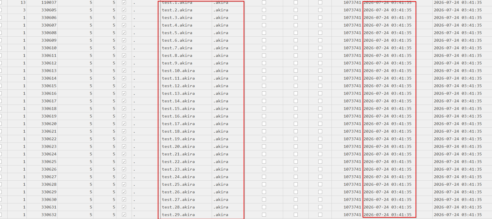

## Q18: Late after the attack, the victim received a message from his work colleague alerting him that his machine is being compromised. What is the name of this colleague?

  `answer:` houari
  `Artifact:` Browsing history shows that telegram web version was visited and with further Anlysis we understand athat the user receied a new message notification. The notification is handled by the OS and recent notifications are stored in `C:\Users\bello\AppData\Local\Microsoft\Windows\Notifications\wpndatabase.db`

  `tools:` SQLITEDB Browser

  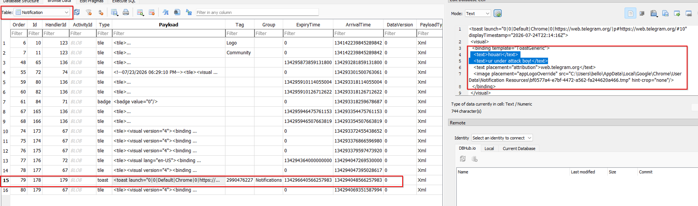


## Q19: "What is the employee's role on the company, and what is his badge number?

  `answer:` Stupid_0x1337
  `Artifact:` Thumbcache databases `C:\Users\bello\AppData\Local\Microsoft\Windows\Explorer` (better resolution is thumbcache_1280.db)

  `tools:` Thumbcache Viewer

  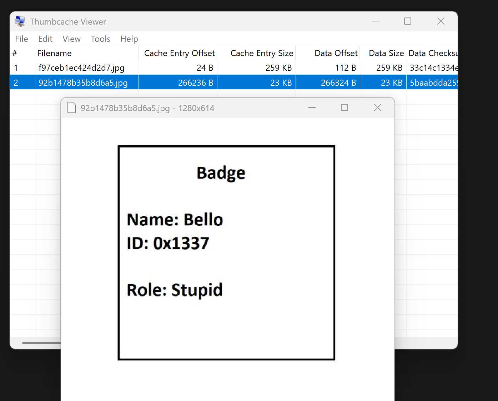

## Q20: Based on the IOCs, which tool/framework serves as the C2 on this incident?

  `answer:` caldera
  as show in the screenshot below, `$wc.Headers.add("file","sandcat.go");` is a strong IOC, `file: sandcat.go` — request the Sandcat agent source/payload. If we google it we understand that is the default agent of caldera adversary emulation framework.

  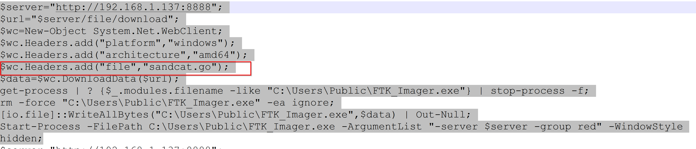

Flag: `L3AK{RMI179QH9DE7VLW8X74T136BXTUPZHIE}`
