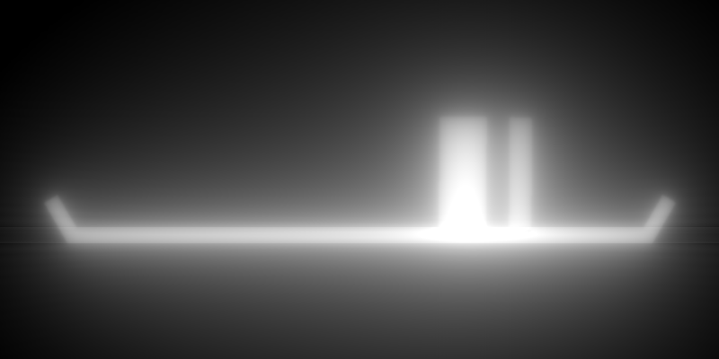
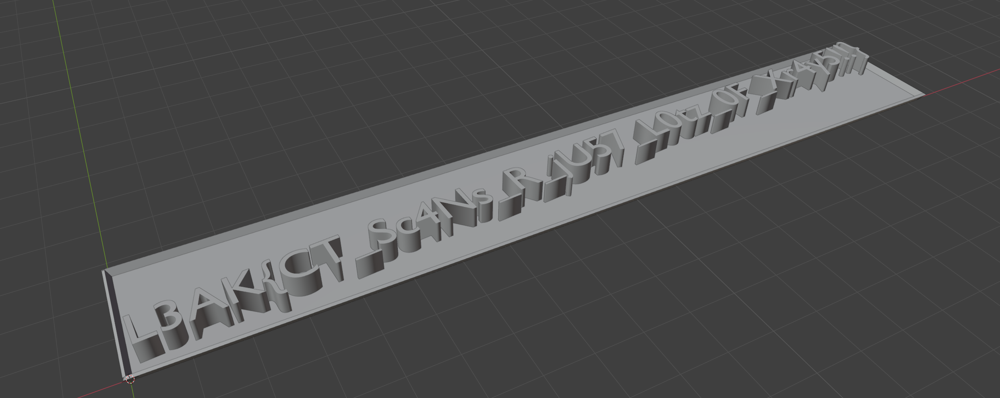

# You Scanned HOW?!?!? Solution
### Author: JAGIC

Looking at the scan, you can tell its a lot similar to the previous challenge. In fact, the solve code is almost exactly the same. The reason this challenge was made was to introduce a different type of scan, a CT or CAT scan. This scan is built on many xrays lined up across an object. They provide cross sections of the object, and reading them is a lot harder than reading just an xray. It surprises me how few people know that xray scans and ct / cat scans are basically the same thing.

To build all of the xray scans, you must add a single for loop to your solve code to loop through all tables in the scan file. My solve code outputs all of the scans in the same folder for organization.

Once you have all of these images, you need to reconstruct the 3d file by stacking all of the images at their height. The easiest way to do this is by eye, and to go image by image seeing what the cross section of the flag is. 

You could also stack these images on a 3d rendering program, but that is not required.

All output is in the output folder in this directory, feel free to take a look and try to solve it from there.

For reference, here was the final flag that the scan was taken of.

Again, using a filter or method to make the images more clear could have been used, but they aren't requited if you don't need a completely clear file.

Final flag: `L3AK{CT_Sc4Ns_R_jU57_L0tz_0F_Xr4y5!!}`
