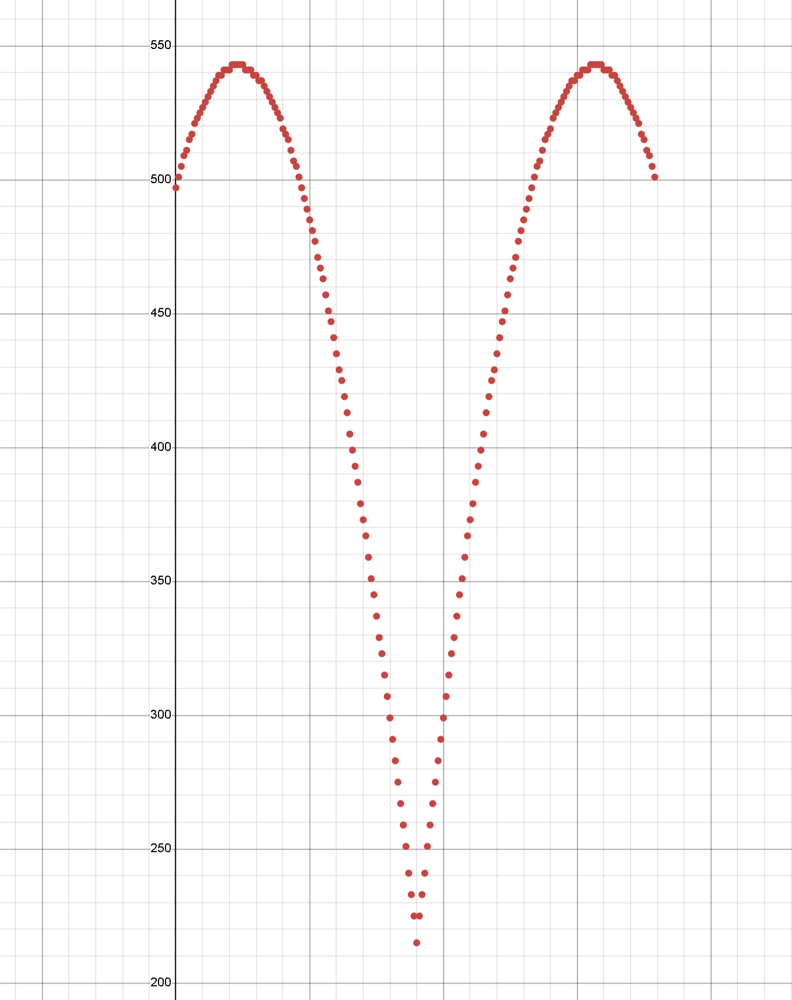
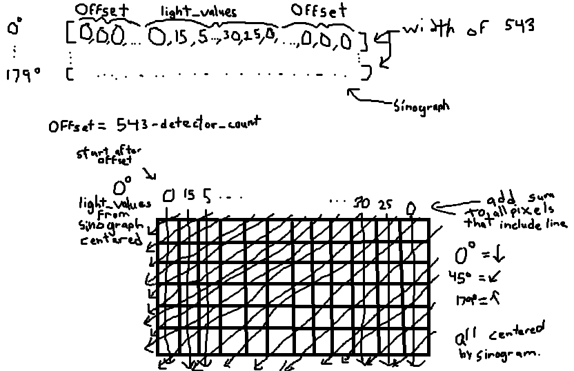
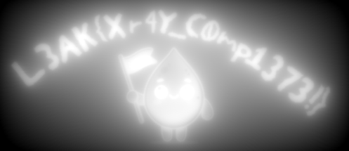

# You Scanned WHAT?!? Solution
### Author: JAGIC
The first step of this challenge, which is arguably the hardest, is to deduce that this file is an xray scan. The scan file includes the following schema:

```
sqlite> .schema
CREATE TABLE projections (
                angle_degrees INTEGER PRIMARY KEY,
                detector_count INTEGER NOT NULL,
                light_values TEXT NOT NULL
            );
sqlite>
```

The `projections` table contains `angle_degrees`, `detector_count`, and `light_values`. angle_degrees refers to what angle the scan was taken from in relation to the object, detector_count specifies how many measurements were recorded at that angle, and light_values contains those measurements.

Through google searches and research, you can deduce that these three variables closely resemble a 2D xray scan. This is due to having 180 degrees of angles of a scan, lots of something being detected, and storing the values of each detector at every angle. This might be a long shot, but moving forward you can confirm this.

Xrays scans are taken when a number of xrays are shot out of one side of an object, and are detected at the other side of an object. These detectors record how much radiation gets through the object, thus how much of an obstacle the path the xray took was. Denser objects will block more radiation, and thus will show brighter on an xray scan.

An important note in this scan is that not all angles have the same detector count. That means we are scanning something that isn't a circle. We can find the ratio of width to height of this shape by finding the detector_count of the scan at 0 and 90 degrees.

```
sqlite> select detector_count From projections Where angle_degrees == 0;
497
sqlite> select detector_count From projections Where angle_degrees == 90;
215
sqlite>
```

Taking a broader look at the scan, we can tell that the detector_count increases as angle_degrees approaches 23, then decreases until 90, then follows the exact reversed increase/decrease as angle_degrees approaches 157, then 179.

```
sqlite> select detector_count From projections Where angle_degrees == 91;
225
sqlite> select detector_count From projections Where angle_degrees == 89;
225
sqlite>
```

Graphing out the data can also help us deduce what kind of shape the canvas of this image is.



As we can see, the detector_count is symmetrical around angle_degrees == 90. Now analyzing the rate of increase and decrease, through deductive reasoning, we can deduce that the object we are scanning is in the shape of a rectangle with a width to height ratio of 497:215. This can be concluded because the detector_count follows the formula for the bounding width of a rotated rectangle. This formula is below:

`|W*cos(angle)| + |H*sin(angle)| = approx_detector_count`

For a rectangle, the maximum width occurs at $\tan^{-1}(H/W)$. Using the proposed dimensions we found earlier at angle 0 and 90, we find the maximum width occurs at $\theta = \tan^{-1}(215/497) \approx 23.4^\circ$, which matches our graph exactly. Angles 0, 90, and as it approaches 180 make sense too, as those are equivalent to taking a side or top view of the rectangle, and thus have the same amount of detectors as their length.

Now that we have concluded this xray scan is of a rectangular canvas, we can use formulas to generate an approximate image of what was scanned.

A little google searching gives us something called the Inverse Radon transform. This algorithm puts all 180 light projection graphs (graphs of detector_count to their corresponding light_values value) together and computes the sum of all xray values that go through each pixel. It also filters to make the image a lot more defined but this is unnecessary for this challenge. This sum is greater on denser objects, since all xrays that go through these denser objects will return a greater change from the detector. Thus all light_values that follow an xray going through a dense object will return a high value. To the visual learners out there, a video that shows this well (and was the inspiration for this challenge) is below:

[https://www.youtube.com/shorts/nE8W-HZR070](https://www.youtube.com/shorts/nE8W-HZR070)

The code for this is simpler than you might think. Since the xray is taken from angles circular to the center of the rectangular image, most online sources use pixel coordinates in relation to the center of the image. That gives us:

x = c - (W-1)/2

y = (H-1)/2 - r

For our given image of size 497x215, this means our pixel x and y equations are:

x = c - 248

y = 107 - r

This makes the center of the image at coordinates (0,0), and our boundaries at ($\pm$248,$\pm$107). 

Since the largest projection angle contains 543 detectors, we can use a sinogram, a 2D array of size 543 and center all light_values to this array for each angle per row.

That just means that the starting pointer for this index for a given detector_count is (543 - detector_count)/2. For the example of a detector_count of 215 (at 90 degrees), the array is filled from (543 - 215)/2 = 164 to 164 + 215 = 378. All other positions are filled with 0.

Once you have a full sinogram, create an empty 497x215 image to store the sum values. Start with 0 degrees as vertical, and add the values of the sinogram from left to right starting from the calculated offset value from the sinograph and add up until the offset starts again on the right. The below exampele image may help:



Doing this vertically and horizontally is simple, but doing this for angles can be a little bit more complicated. The below code is the calculation to find the sinogram x and y at any angle.

```
x = column - 248
y = 107 - row

distance_along_detector = x*cos(angle) + y*sin(angle)


sinogram_position = 271 + distance_along_detector
```

Now that the logic is explained, take a look at solve.py. Most of it is self explanatory or explained through the comments. It looks long but if you see what its doing, its not that complicated. A lot of it is just formatting taking everything from the SQLite database and turning it into a sinogram, which is quite simple. The logic from the code above can be seen in reconstruct(...). The outputted `output.png` is below.



Final flag: `L3AK{Xr4Y_C0mp1373!}`

Note: there are a bunch of methods and filters you can put on this output to make it more readable, but they weren't required for this challenge.

Also, unknown to me, there was a [github repo](https://github.com/scikit-image/scikit-image) out there that solves this challenge and includes filtering and all, so that's kinda cooked 💀. I guess I should have looked for something like that lol. Since there isn't any standard that I found for what direction the degrees should go, I decided to make the handout start with 0 degrees in the positive x direction, moving clockwise with every increase in degree. scikit also starts with 0 degrees in the positive x direction, but rotates counter-clockwise. This just results in an image that is rotated 180 degrees from the final flag image.
