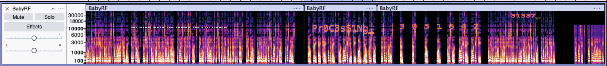

# BabyRF Solution

This is a beginner-friendly challenge which gives us an audio file named `BabyRF.wav` with instructions on what to do - recover all 6 parts of the flag scattered throughout the audio!

Embedded Flag Parts:

1. `L3AK{4uD10_` is spoken character-by-character at around `23.5s`. However, the audio segment is reversed and polarity-inverted. We can see this in the spectrogram because there is a word written there in reverse. In Audacity we can select the audio segment and then choose `Effect` --> `Special` --> `Reverse` to reverse it and hear the phrase.
2. `S1gNaL_` is spoken character-by-character at `33s`, but the characters are cut and shuffled. The actual phrase we hear is `NSL1_ag` which obviously isn't right, and viewing the spectrogram at this point we can see overlapping indices `[3, 0, 5, 1, 6, 4, 2]` which reveal the proper ordering of the letters. We sort the spoken characters by those 0-indexed numbers to get `S1gNaL_`.
3. `Pr0C3sS1Ng_` is written in plaintext on the spectrogram overlapping the spoken part 1 flag. It is time-mirrored in the wav file and reads normally after reversing the part 1 audio segment.
4. `R3QU1RES_` is Morse Code near `6s` at about 11.5 kHz. Morse: `.-. ...-- --.- ..- .---- .-. . ... ..--.-`
5. `31337_` is plaintext spectrogram text starting near `43s`, drawn above the normal human hearing range from about 22 kHz to 35.5 kHz. By default most spectrogram viewers do not show frequencies above 20kHz, so we have to manually raise the spectrogram maximum frequency to see it. In Audacity we can do this by selecting the audio with `Ctrl+A`, selecting the `...` next to the track name to open the menu, selecting `Spectrogram Settings`, and setting `Max Frequency (Hz)` to 40000. Then the text `31337_` will be revealed in the high frequency bands.
6. `5K1LLs}` is spoken in very quiet, sped-up speech starting near `49s`. It is sped up by 3.35x and mixed at 0.004 gain (0.4% volume) so that we only hear a short, almost-silent blip at the end of the audio file. In Audacity, we can slow it down by choosing `Effect > Pitch and Tempo > Change Speed and Pitch` and set `Speed Multiplier` to around 0.3. We can then increase the volume by choosing `Effect > Volume and Compression > Amplify` and set the amplifier value to 40dB.

Flag: `L3AK{4uD10_S1gNaL_Pr0C3sS1Ng_R3QU1RES_31337_5K1LLs}`

