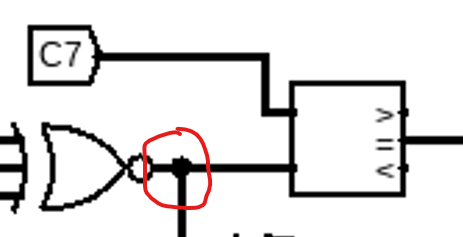

# Software is a scam Solution
### Author: JAGIC

If you understand circuits, this challenge shouldn't be that hard. It should mostly be tedious.

The circuit diagram is actually 3 seperate circuits. I will solve them here individually. They all are required for the password to be right, but none of the input characters in these three blocks effect any of the input characters in any other block.

For circuit one, we have four input characters labeled 1-4. If we look closely, there are 5 subcircuits that all need to be true for the password to autheticate. Those circuits can be written like so:
```
((C1 x C4) + C1) xnor C2 == 5c
(C1 & C3) nor (C2 xor C4) == 87
C3 xor C4 == 0a
C2 - C1 == e7
C3 - C1 == f4
```
To solve this series of equations, we know the flag must be printable, thus we can bound all characters between 32 and 127. with that, we can brute force this series smartly by starting with the equations that cancel out the most possibilities. One thing to note is that since the circuit is discarding all extra bits, we need to mod each arithmetic section by 256 (0xff). We start with `C3 xor C4`, `C2 - C1 == e7`, and `C3 - C1 == f4` in no particular order because all of these equations only include two characters, and thus are easy to brute force to lower the possibilities. Then, we can just add more if statements for the last circuits. The solve script I wrote is attached at `solve1.py` (pardon my awful code), and it computes all possibilities.

The series of circuits in the first section only lead to a single possibility for characters 1-4.

Flag part one: `L3AK????????????????`

For the 2nd large circuit, we can do the same thing. We have 4 characters, and we have a total of 5 sub-circuits to validate those characters. We can write those circuts as so:

```
C5 - C20 == fe
(C10 & C20) xor !(C5) == d9
(C5 & C10) & (C15 xnor C20) == 59
d6 > (C15 + C10)
bd < (C15 + C10)
```

Again, we start with the equations with the least characters, `d6 > (C15 + C10)` and `bd < (C15 + C10)`. Then, the rest of them all include C5 and C20 so we can use another two nested for loops to get through the rest of the equations. Again, pardon my awful code, my solve script is attached in `solve2.py`.

This series of equations also gives us a single possible combination of C5, C10, C15, and C20.

Flag part 2: `????{????_????_????}`

For the 3rd and largest circuit, we follow the same steps but at a larger scale. We see 11 sub-circuits that all seem intertwined. If you look closely enough though, there are several near the middle and bottom that require only 2 characters to validate. We start with six, thirteen, eight, sixteen, and seventeen (in an order where each number allows the next to be found with a single for loop) since all of these characters can be found via a single for loop comparison with another number. Then we move on to the much larger equations. The order doesn't matter much from here, but tis important to have the most if statements before your for loops as possible.

My solve code is attached at `solve3.py`. One note that I have is that I simplified one of the equations from 5 calculations to one, since C7 is directly compared to this last connection. I am sure there are far more logic jumps you can simplify from, but none of those were really necessary for this challenge.



Again, there was only one possible combination that would verify the circuit.

Flag part 3: `?????CoD3?Hur7?h34D?`

Final combined flag: `L3AK{CoD3_Hur7_h34D}`
