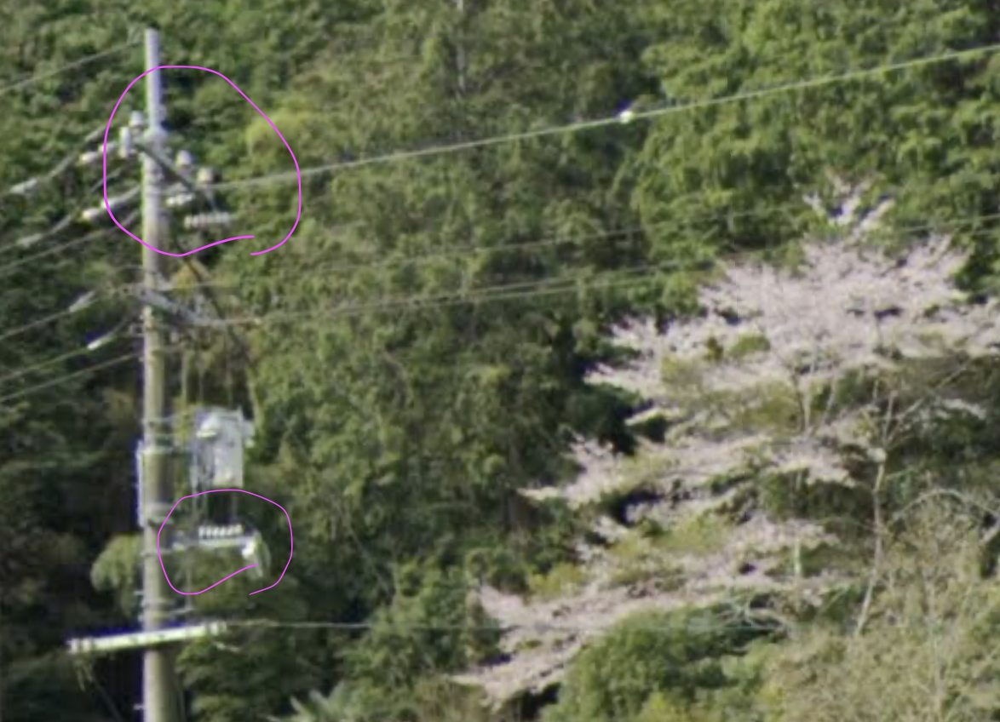
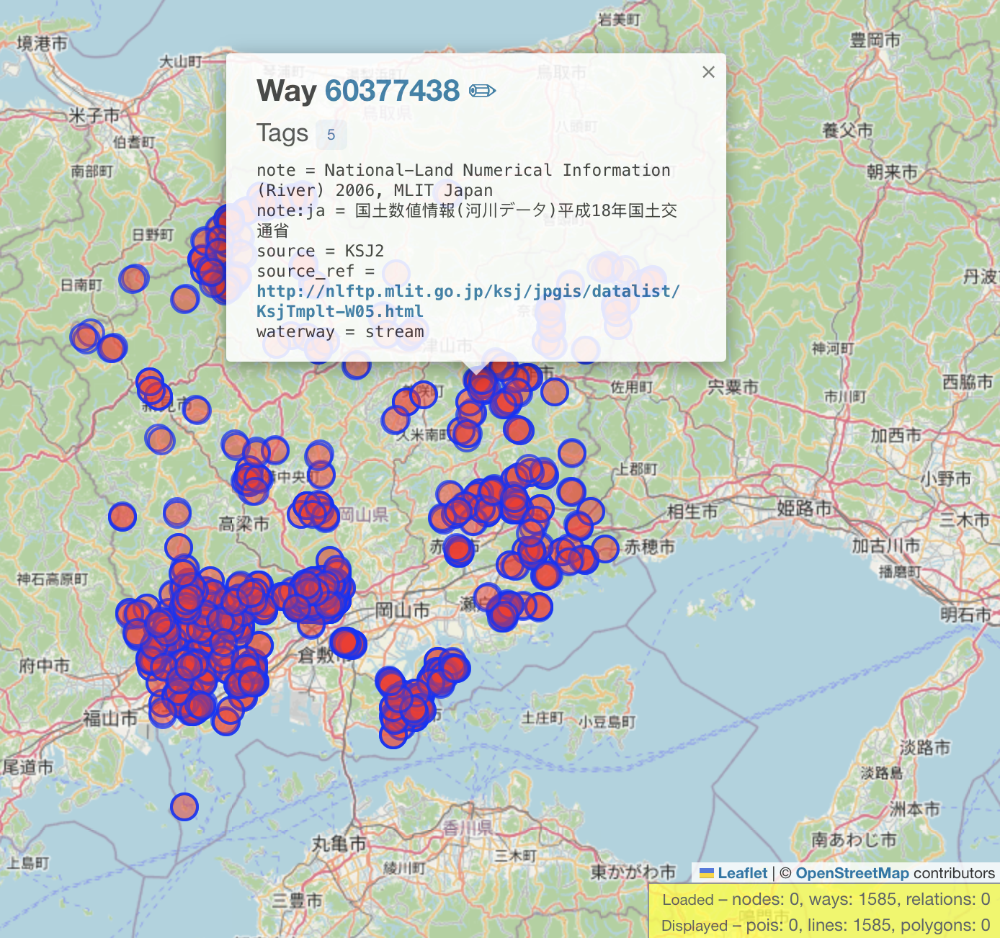
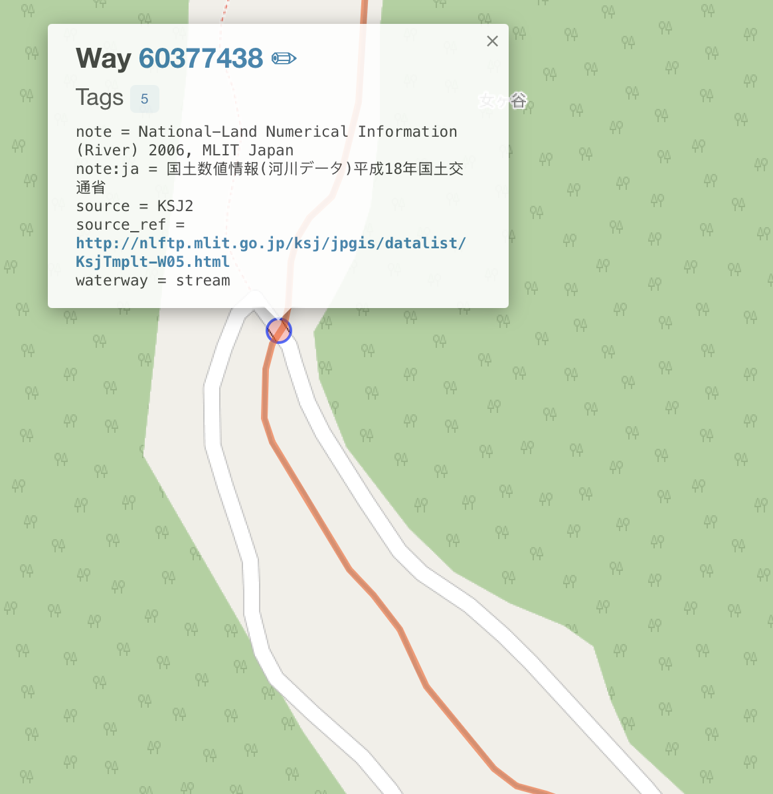

# Cherry Blossoms Solution
### Authors: Suvoni, OnyxCinder

We find ourselves in rural Japan, in a small hilly farmland dotted with blooming cherry blossom trees. We are on an unmarked road next to a stream, some houses, agricultural land, lots of trees, and several utility poles. There is no signage nor markings which directly reveal our location; however, we already have all the information we need.

The utility poles are our first clue - based on the [Japan plonkit guide](https://www.plonkit.net/japan#2), the transformer on the utility pole has the long horizontal insulators which are distinctive of the Chūgoku region, which narrows down our search from 47 prefectures to only 5: Hiroshima, Okayama, Shimane, Tottori and Yamaguchi.



Our next clues are the bridge and stream - these features are [usually marked in OpenStreetMap](https://wiki.openstreetmap.org/wiki/Key:bridge), and combining both while filtering out urban locations should give us a small enough list for brute-force visual inspection. Between all 5 prefectures, the number of rural bridges over streams numbers in the thousands. However, using the oval-curved shape of the road as an additional vector of information, we can reject most options immediately from the map view without analyzing them individually at the street-level.

Here is a Overpass Turbo query which finds all rural bridges in Okayama within 20m of a stream:
```
[out:json][timeout:500];

area["boundary"="administrative"]["admin_level"="4"]["name"="岡山県"]->.okayama;

// Filter out "large cities"
(
  area(area.okayama)["boundary"="administrative"]["name"="岡山市"];
  area(area.okayama)["boundary"="administrative"]["name"="倉敷市"];
  area(area.okayama)["boundary"="administrative"]["name"="津山市"];
)->.large_cities;

(
  way(area.okayama)["bridge"="yes"]["highway"~"^(unclassified|residential|track)$"];
  - way(area.large_cities)["bridge"="yes"]["highway"~"^(unclassified|residential|track)$"];
)->.small_bridges;

way(around.small_bridges:20)["waterway"="stream"]->.nearby_streams;
way.small_bridges(around.nearby_streams:20)->.hits;

(
  .hits;
  way(around.hits:20)["waterway"="stream"];
);
out tags geom;
```

This returns 1585 results, but looking among the most rural locations (least dense spots on the map) and scanning for roads which match the shape of ours will quickly yield the answer.




[Challenge location](https://maps.app.goo.gl/YryxyBHgK7Czimcj6)

Flag: ``L3AK{Ch3RrY_Bl0S50m_Tr33s_Cr34Te_SpR1nGtiM3_Dr3Ams}``
