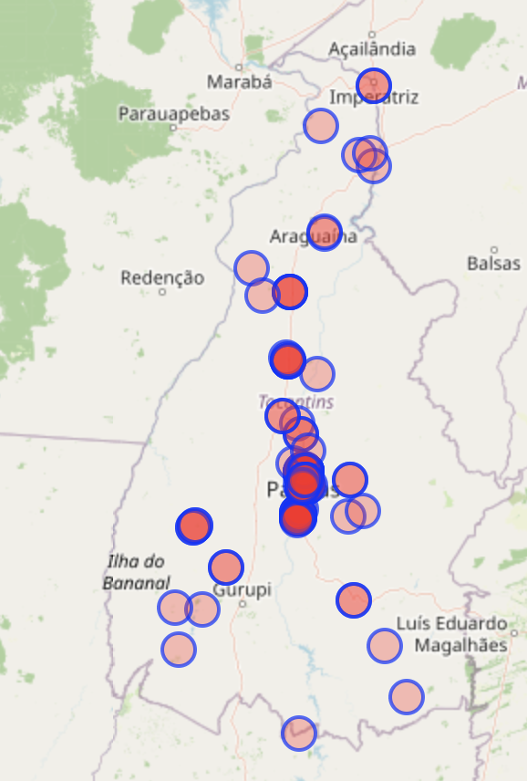
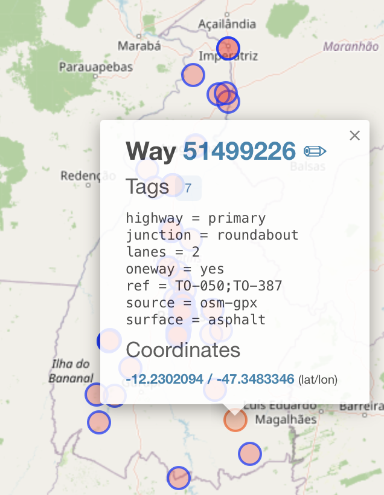

# Circular Reasoning Solution
### Author: Suvoni

We are dropped in a lush, flat landscape on a black concrete highway. At first glance it looks like we are in the middle of nowhere, but there are some notable features, particularly the letters "PARE" written on the road (indicating we are in a Spanish/Portuguese-speaking country) and the fact that we are on a roundabout. Using the language clue and surrounding vegetation we can assume that it's highly likely we are in a South American country, such as Brazil. Brazil is coincidentally the largest South American nation and [has the most roundabouts in South America](https://www.discovercars.com/blog/roundabouts), so it seems like the top candidate country to search in.

Thankfully, OpenStreetMap documents roundabouts and we can easily write an overpass turbo query to filter those locations. However, Brazil has at least ~12,000 roundabouts which is too many to efficiently check via brute force visual inspection. To reduce the size of the candidate location list, we can write an overpass turbo query to only find rural (i.e., not within city limits) roundabouts within each Brazilian state (there are only 26 total) and then quickly check the resulting locations for a match.

This query returns 166 results for the state of Tocantis:
```
[out:json][timeout:240];

area["ISO3166-2"="BR-TO"][admin_level=4]->.tocantins;

// All roundabouts / mini-roundabouts in Tocantins
(
  way(area.tocantins)["junction"="roundabout"]["highway"];
  relation(area.tocantins)["junction"="roundabout"]["highway"];
  node(area.tocantins)["highway"="mini_roundabout"];
)->.roundabouts;

// Urban landuse near roundabouts
(
  way(area.tocantins)(around.roundabouts:500)
    ["landuse"~"^(residential|commercial|retail|industrial)$"];

  relation(area.tocantins)(around.roundabouts:500)
    ["landuse"~"^(residential|commercial|retail|industrial)$"];
)->.urban_landuse_near;

// Settlement/place nodes near roundabouts
(
  node(area.tocantins)(around.roundabouts:2000)
    ["place"~"^(city|town|village|suburb|neighbourhood)$"];
)->.settlements_near;

// Roundabouts to exclude
(
  way.roundabouts(around.urban_landuse_near:500);
  relation.roundabouts(around.urban_landuse_near:500);
  node.roundabouts(around.urban_landuse_near:500);

  way.roundabouts(around.settlements_near:2000);
  relation.roundabouts(around.settlements_near:2000);
  node.roundabouts(around.settlements_near:2000);
)->.exclude;

// Rural-ish roundabouts
(
  .roundabouts;
  - .exclude;
)->.rural_roundabouts;

.rural_roundabouts out center qt;
```
Note that many roundabouts are not tagged as rural correctly, so the number of valid locations is actually much less than those returned by the OpenStreetMap API. Notice that in the following image, there are quite a few city roundabouts returned (e.g., in Palmas)



Quickly scanning through the rural locations, we find the right location here:



[Challenge location](https://maps.app.goo.gl/MucFEt1jt4gygi6z8)

Flag: ``L3AK{0P3N_StR3E7_M@P_T4g5_m@nY_1nT3reSt1Ng_Th1Ngs}``

Shoutout to Ahmed Salem from PwnSec who had an even better Turbo query, which only included roundabouts within 5 km of a terrain feature (note the large hill in the distance). This additional vector of information narrowed down the result set drastically, and I thought it was rather clever. Check out his writeup [here](https://medium.com/@King_Night/l3akctf-2026-osint-write-up-d0803b3a4a18).
