# Drippy Adventures Solution
### Author: JAGIC

We start out given a unity game build folder. After unzipping and running the game, we find out that the player is caught within a fence, with two signs explaining the situation.

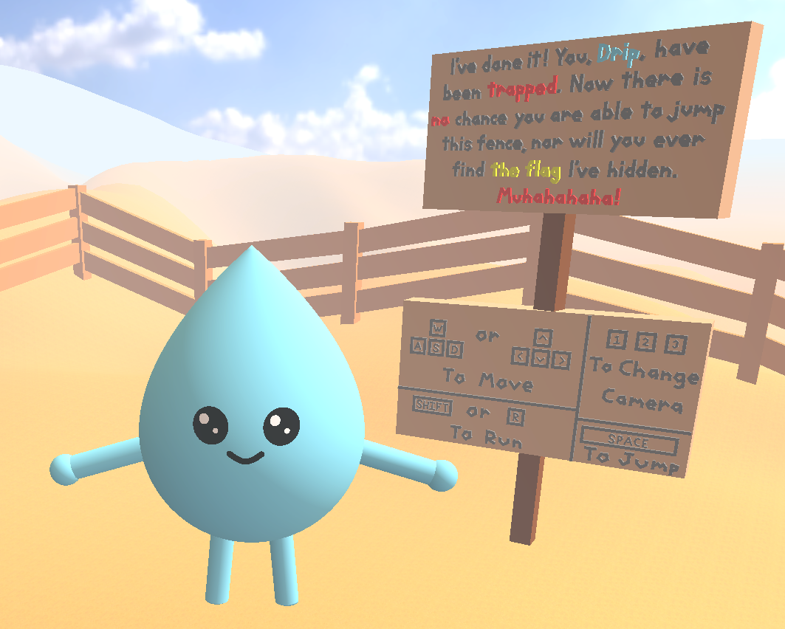

Taking a quick look around reveals the seemingly large flag in the distance. Now we have our target.

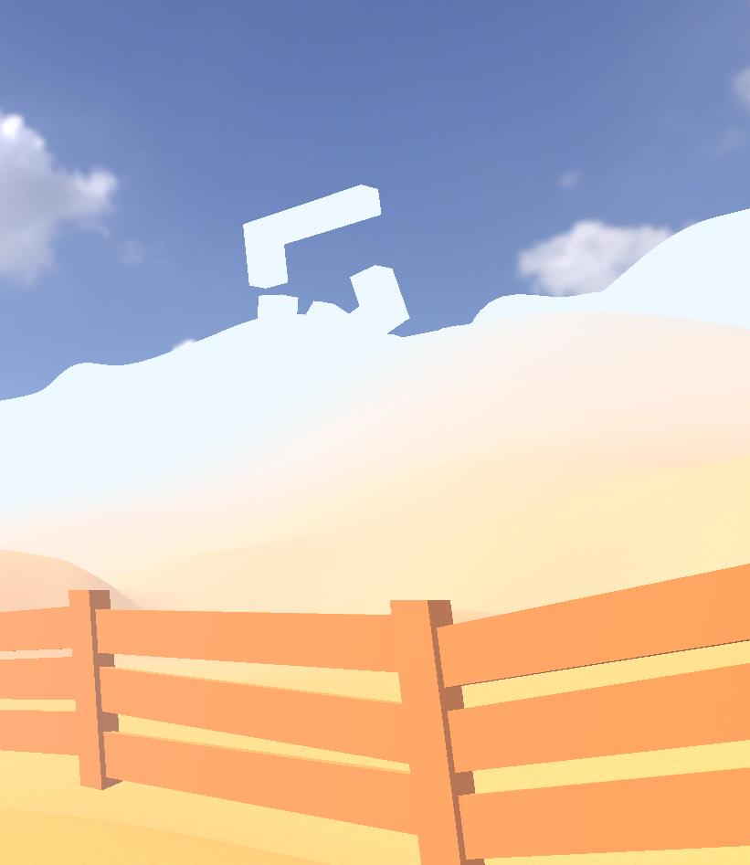


First, it is important to note that all player made scripts are stored in `Drippy Adventures_Data/Managed/Assembly-CSharp.dll`. We can view and edit these with dnSpy.

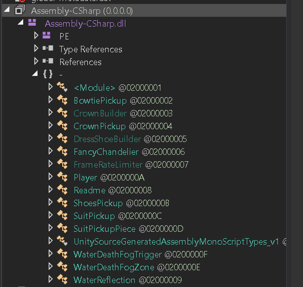

From here, we can see that the most important script file to us at the moment is the Player.cs file. It contains all scripting relating to the player and the player's generation. By finding the HandleMovement() method, we can change/add controls to the player, allowing us to do more things.

For instance, looking into the flag3 variable (has nothing to do with a ctf flag, this means flag in the Boolean sense), we note that it depicts what happens if the space bar is pressed and what happens if the "coyoteTimer" is greater than zero. With a little more looking into the logic, we can see that the coyoteTimer is the timer that tells how long a player has been in the air for before not being able to jump (there is a slight time allowed to jump after falling off an object). By removing this timer from the flag3 condition, we allow ourselves to jump midair. This is just one example of how to get to the next step, there are many ways of continuing, such as Cheat Engine, New buttons to hover in place, increasing the jump height, etc. I should note that for every change in dnSpy, you must save in the top left File drop down, then you must restart the game. Also, with cheat engine, you must run `this.controller.enabled = false;`. This is explained further in the next few sections.

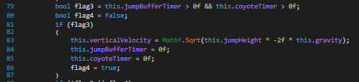

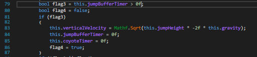

By also increasing the jumpHeight variable, we can jump infinitely in midair.

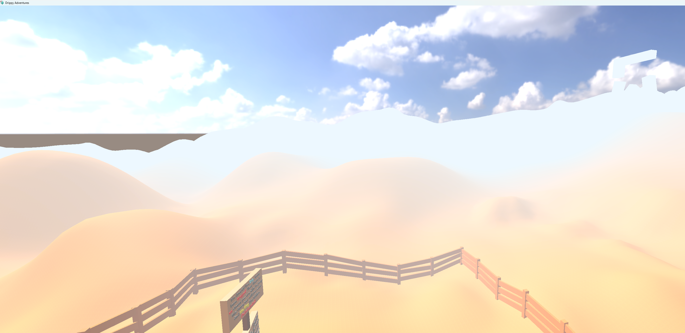

Once we get to our desired location, we find a hole with part of the flag.

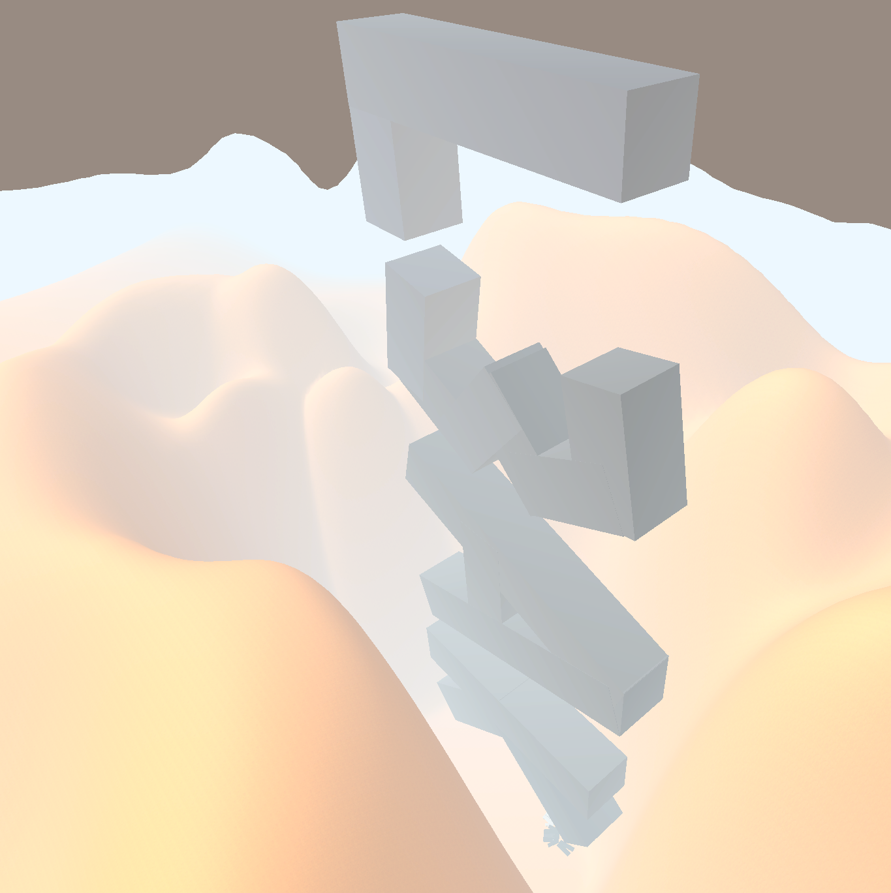

This gives us part of the flag, `L3AK`.

At the bottom of the hole, we see a sign and some equipable drip.

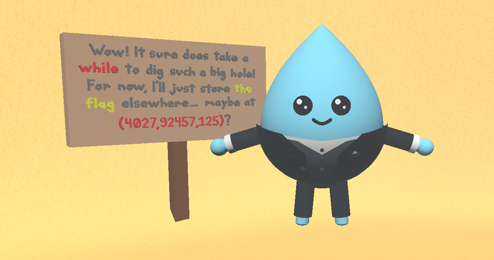

Moving to these coordinates is simple in Unity c#. We can bind a new key to change our x, y, and z values to these positions with the following code added anywhere in HandleMovement():

```
if (current.gKey.wasPressedThisFrame)
{
	this.controller.enabled = false;
	this.controller.transform.position = new Vector3(4027f, 92457f, 125f);
	this.verticalVelocity = 0f;
	this.controller.enabled = true;
}
```

Note that this custom Player object uses Unity's CharacterController object, which disallows unnatural movements such as direct position changes. This type of object can be easily gotten around though by turning its enabled value to false.

Restarting the game and pressing `g` does indeed teleport us to the location mentioned on the sign. We are brought to another desert with another part of the flag laid out, along with another sign and some collectable boots.

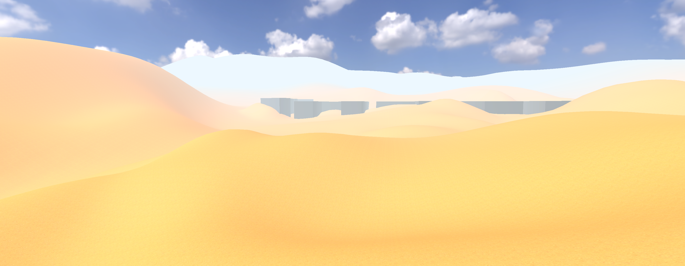

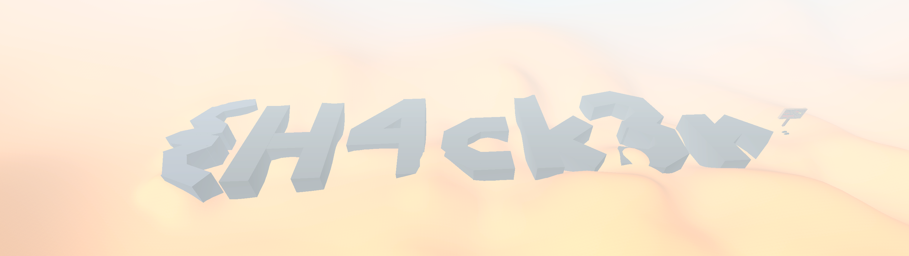

This gives us part of the flag, `{H4ck3r`.

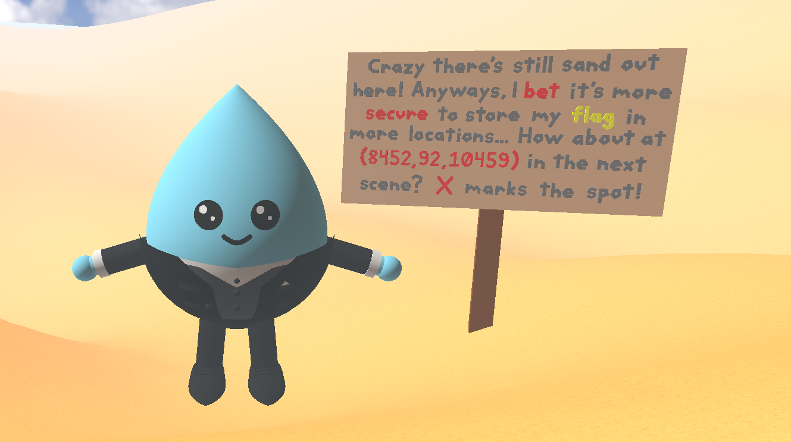

To get to the next scene, we can add a new keybind for going to the next scene, and another one for teleporting us to the given coordinates. This could be done in the same keybind but for simplicity's sake I put them separate. You could also turn `this.controller.enabled = false` and use Cheat Engine to teleport to the right location. The following code brings you to the next scene:

```
if (current.vKey.wasPressedThisFrame)
{
	int currentScene = UnityEngine.SceneManagement.SceneManager.GetActiveScene().buildIndex;
	int nextScene = currentScene + 1;
	if (nextScene < UnityEngine.SceneManagement.SceneManager.sceneCountInBuildSettings)
	{
	UnityEngine.SceneManagement.SceneManager.LoadSceneAsync(nextScene);
	}
}
```

To have it compile you will also need to add this import at the top:

```
using UnityEngine.SceneManagement;
```

You can replicate the same code from before to teleport to a different location using a different Vector3(x, y, z).

Once at this new location, we find ourselves in a grass field. A little to the left, we can see a giant red X in the ground. From the hint in the last sign, we can deduce that the flag is below this X. To get there, we can either move around the terrain and then move under it, or just add another keybind to move under it. I will note again that I am only mentioning one or two possible paths to the flag, but there exist countless other ways to the flag. This challenge is flexible in that way.


In this case, I made a keybind to teleport the player 1 unit beneath their current position. The code is below:

```
if (current.jKey.wasPressedThisFrame)
{
    this.controller.enabled = false;
    base.transform.position = base.transform.position + 10*Vector3.down;
    this.verticalVelocity = 0f;
    this.controller.enabled = true;
}
```

Note that Vector3.down is just a unit vector facing down.

This reveals the flag alongside a new sign and a collectable bowtie.


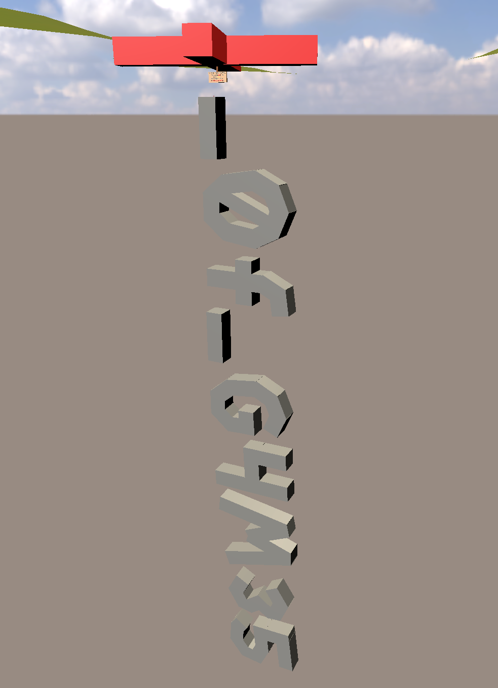

This gives us another part of the flag, `_0f_G4M35`.

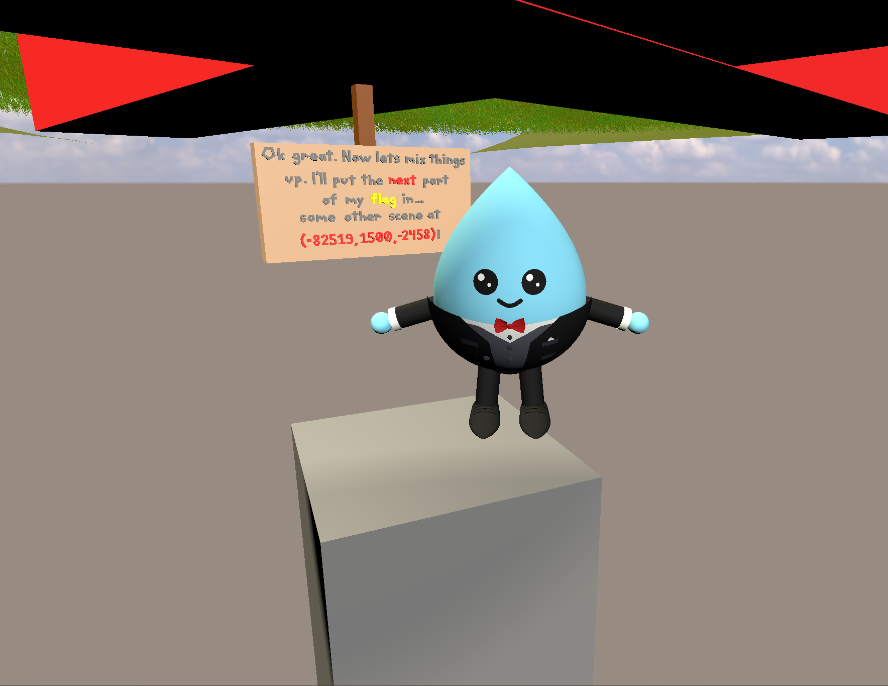

We are told that the next flag fragment is at a specified coordinate in another scene. If we take a quick look at some of the other scenes (press v if you are following along), they all seem to look the same. There are multiple ways of finding the next flag fragment, but the path I would like to highlight here is file size. If we look at the Drippy Adventures_Data file, we find all the scene files labeled level{Number}. We see that scenes 0 and 1 have an abnormal size (1944 KB and 618 KB respectively) While every other scene has either 329 KB or 18KB. This is with the exception of level176 with the abnormal size of 1115 KB. From this data, we can make a hierarchy of levels to check out first. Since level176 has the most abnormal size, we should check that level out first to see what is taking up all that space. Next, we should check out the 349 KB files to see why they have greater size. Lastly, if we have not found anything yet, we should check the nearly empty 18 KB levels one by one.

To get to each particular scene, you can use the same function above using the same scene index as stated in the file naming convention. Unity auto names its scenes level{number} where the number is the index stored for that scene. This makes our code convenient for this step.

```
if (current.bKey.wasPressedThisFrame)
{
	SceneManager.LoadSceneAsync(176);
}
```

Also remember to make another teleport hotkey to the new coordinates.

Using this, we find our top priority scene is in fact the one that we wanted to look for. Teleporting to the given coordinates gives us two signs to read.


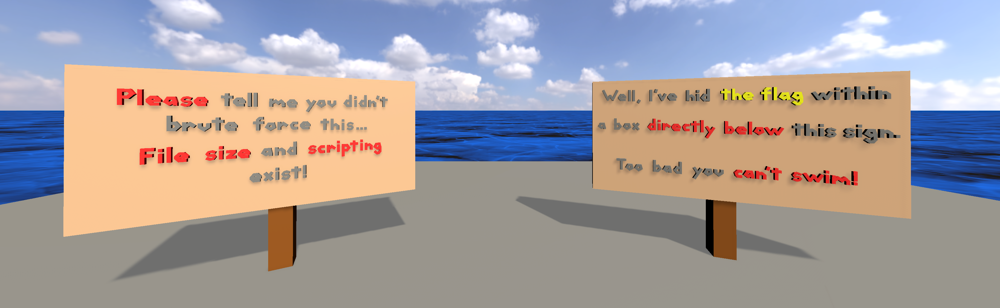


The first sign is just there to mess with the people who brute forced all 176 prior scenes before checking this one. The second sign gives us our next objective to get into the box below us. There are a couple ways to do this. You can remove the death code from Player.cs, you can remove the death plane in WaterDeathFogTrigger.cs or WaterDeathFogZone.cs, you could guess and check depths to teleport the player, etc. 

I simply removed all innards of the BeginDeath(Player) method from the WaterDeathFogZone.cs file, and that successfully removed the issue of dying underwater. Then, with a little bit of guess and check, I was able to adjust the j keybind to teleport me through the top wall of the underwater box.

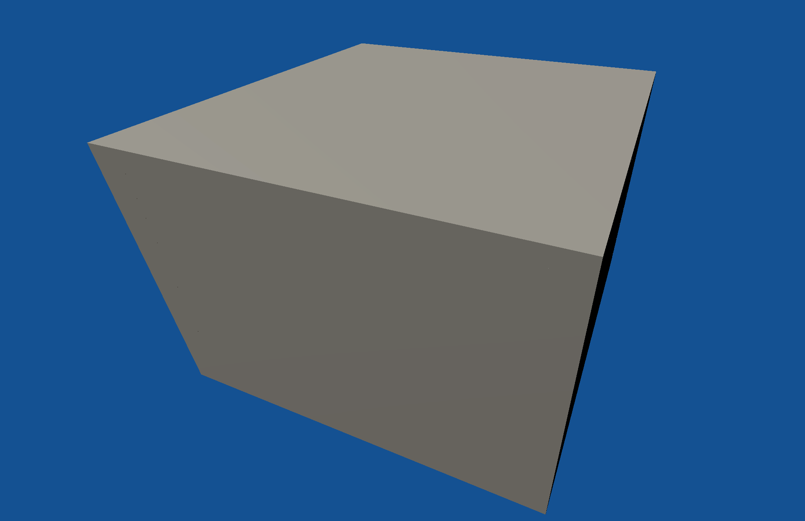

With this method, I was able to get into the box and recover another part of the flag and 2 more signs.

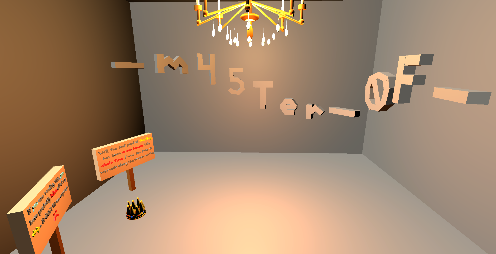

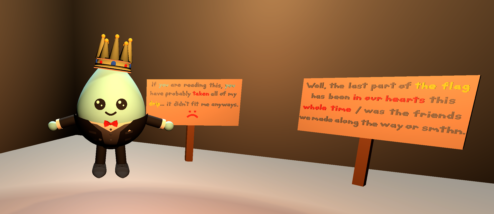

This gives us another part of the flag, `_m45Ter_0F_`.

The sign on the left reveals that the last part of the flag is "in our hearts", i.e. is inside the player. As always, there are a lot of ways of getting to this flag, such as deleting the character model in Player.cs, or removing the scroll cap on the player's scroll wheel zoom. I opted for the latter. in HandleCameraZoom() in Player.cs, simply remove the

```
this.currentBehindZoomDistance = Mathf.Clamp(this.currentBehindZoomDistance, min, normalMaxCameraDistance);
```

line from either the BehindPlayer if statement or after both FirstPerson and BehindPlayer if statements (the in front of player camera section).

Then you will need to allow a higher level of pitch for the camera. Simply remove all clamps in PlaceOrbitCamrea() and HandleCamera() and you should be good to go.

Then load up the game again, go into either the front or back view, and zoom into the player to retrieve the last flag.

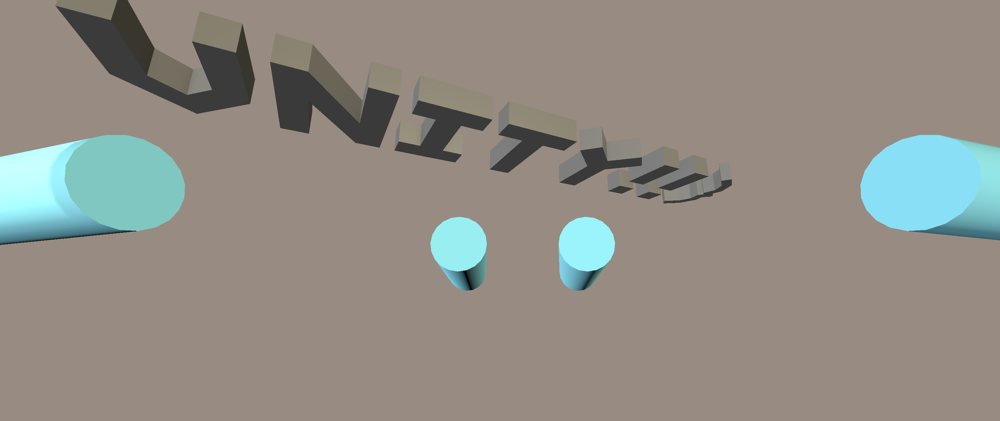

This gives us the last part of the flag, `UNITY!!}`.

That gives us a combined flag of `L3AK{H4ck3r_0f_G4M35_m45Ter_0F_UNITY!!}`
